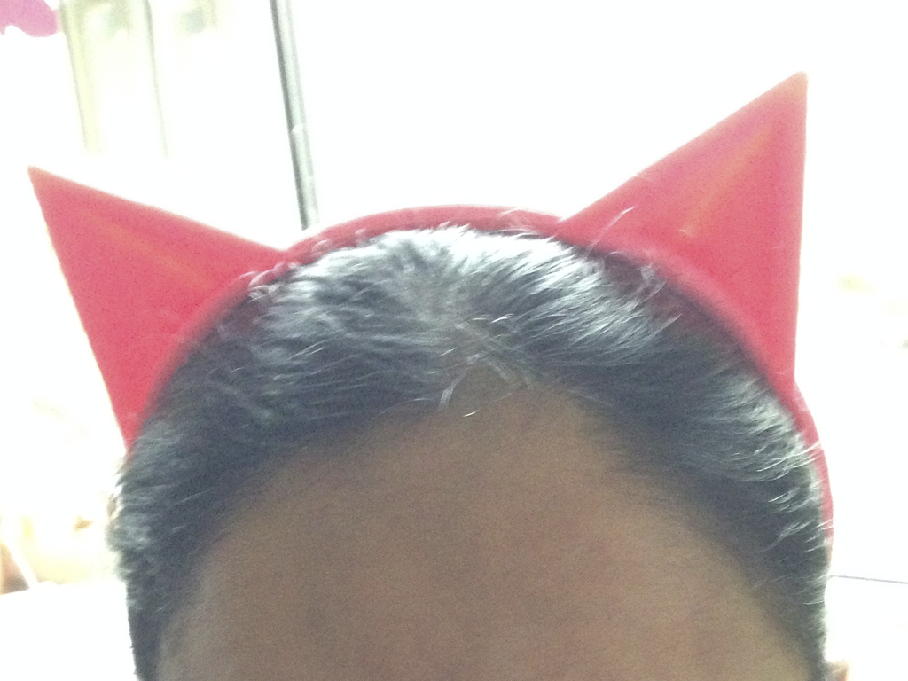
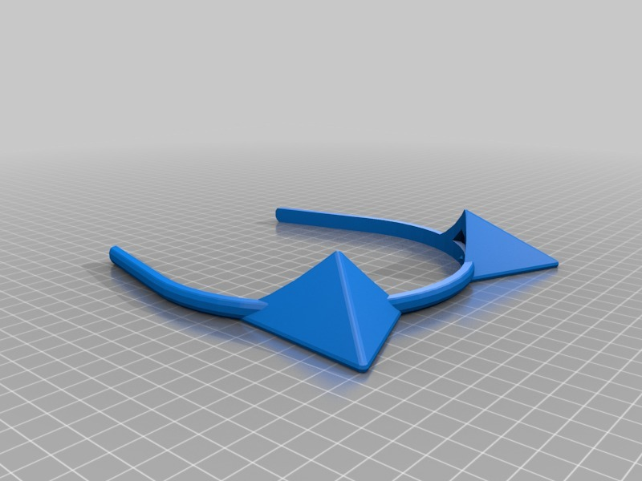

140mm pointy ears headband
===============
**Please note: This thing is part of a list that was [automatically generated](https://github.com/carlosgs/export-things) and may have been updated since then. Make sure to check for the current license and authorship.**  

140mm pointy ears headband  by HamOp , published Jan 22, 2014

Description
--------
Customized version of <a href="http://www.thingiverse.com/thing:49196" target="_blank" rel="nofollow">thingiverse.com/thing:49196</a>  
 
Created with Customizer! <a href="http://www.thingiverse.com/apps/customizer/run?thing_id=49196" target="_blank" rel="nofollow">thingiverse.com/apps/customizer/run?thing_id=49196</a>  
 

Instructions
--------
Using the following options:   
 
pointyness = 40   
faces = 48   
ear_style = 1   
ear_angle3 = 40   
ear_angle2 = 70   
ear_angle1 = 20   
head_size = 140   

Files
--------

 [ headband_20140122-19506-s2eerq-0.stl](headband_20140122-19506-s2eerq-0.stl)  

Pictures
--------

Tags
--------
customized  

  

License
--------
140mm pointy ears headband by HamOp is licensed under the Creative Commons - Attribution - Share Alike license.  

By: Stefan
--------
<https://github.com/HamOP>