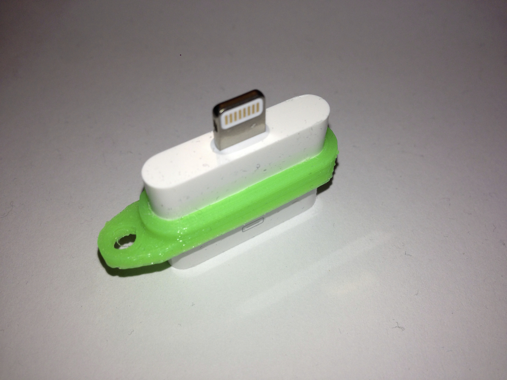
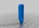
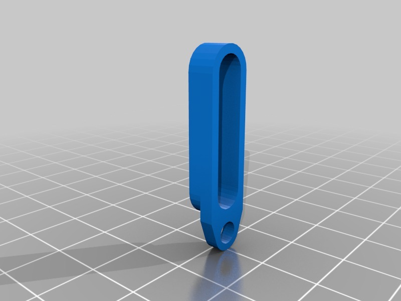

30-pin Dock connector to Lightning adapter pendant
===============
**Please note: This thing is part of a list that was [automatically generated](https://github.com/carlosgs/export-things) and may have been updated since then. Make sure to check for the current license and authorship.**  

30-pin Dock connector to Lightning adapter pendant  by HamOp , published Feb 15, 2014

Description
--------
Small thing to fix the 30-pin-to-lightning adapter to somewhere.

Instructions
--------
None

Files
--------

 [ dockconnector_lightning_pendant-V2.stl](dockconnector_lightning_pendant-V2.stl)  

Pictures
--------

Tags
--------
apple , dock_connector , key_chain , lightning , pendant  

  

License
--------
30-pin Dock connector to Lightning adapter pendant by HamOp is licensed under the Attribution - Non-Commercial - Share Alike license.  

By: Stefan
--------
<https://github.com/HamOP>