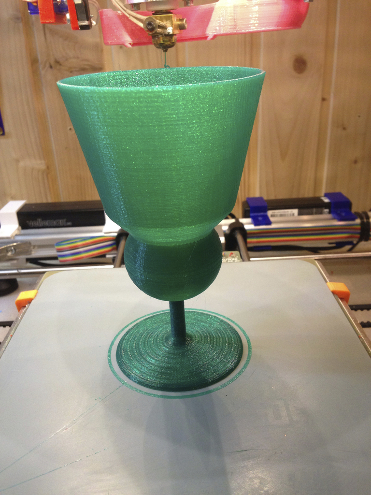
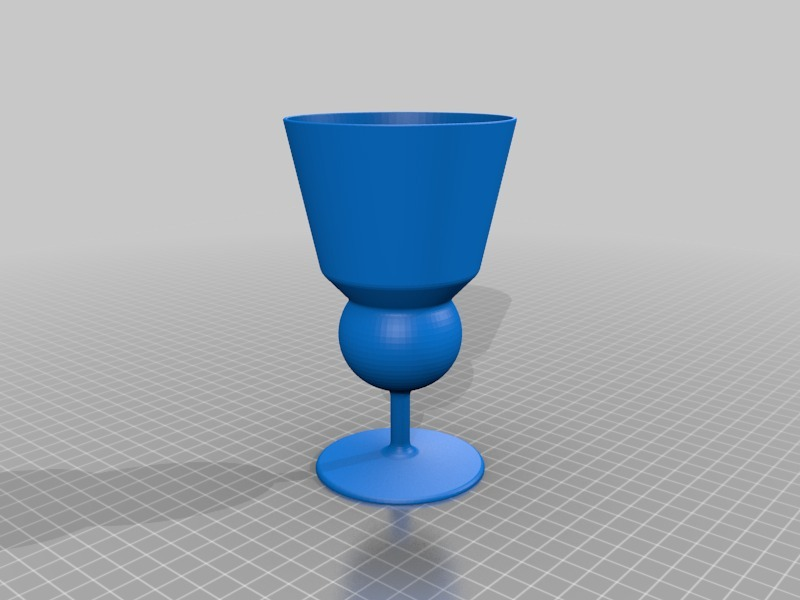

Absinth glass with reservoir
===============
**Please note: This thing is part of a list that was [automatically generated](https://github.com/carlosgs/export-things) and may have been updated since then. Make sure to check for the current license and authorship.**  

Absinth glass with reservoir  by HamOp , published May 25, 2014

Description
--------
After making Big-E's Balancier (http://www.thingiverse.com/thing:123557), I thought that I needed a stylish absinth glass to go with it. As it's Sunday today and I cannot buy one, I'm currently printing one ;-)   
 
It has a reservoir in the bottom which will hold 4 cl of absinth and should be big enough (if my calculations were right) to allow an up to 1:5 thinning of it.

Instructions
--------
None

Files
--------

 [ Absinth-Glas.stl](Absinth-Glas.stl)  

Pictures
--------

Tags
--------
absinth , absinthe , glass  

  

License
--------
Absinth glass with reservoir by HamOp is licensed under the Attribution - Non-Commercial - Share Alike license.  

By: Stefan
--------
<https://github.com/HamOP>