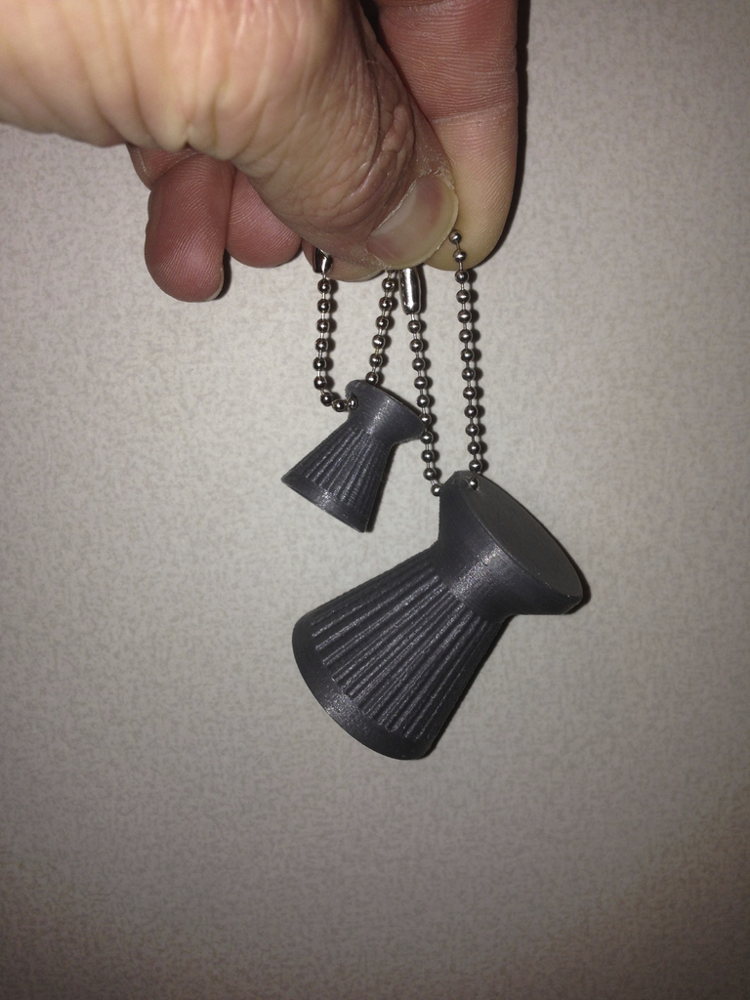
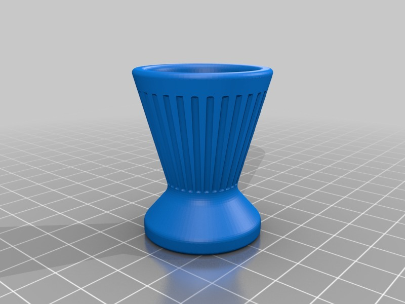
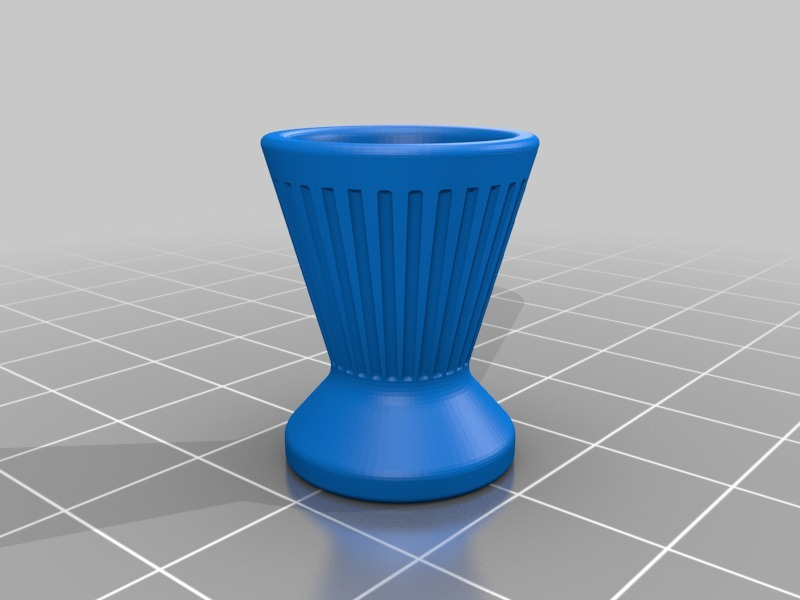

Air gun pellet (Diabolo) pendant
===============
**Please note: This thing is part of a list that was [automatically generated](https://github.com/carlosgs/export-things) and may have been updated since then. Make sure to check for the current license and authorship.**  

Air gun pellet (Diabolo) pendant  by HamOp , published Jul 10, 2014

Description
--------
This is a simple keychain pendant in the shape of an air gun pellet for all the shooters among you ;-)   
It has a hole in the tip to pull a chain through it. There are two sizes; the chain hole is 3 mm on each one.

Instructions
--------
Looks great in silver!

Files
--------

 [ Diabolo_Keychain.stl](Diabolo_Keychain.stl)  

 [ Diabolo_Keychain_large.stl](Diabolo_Keychain_large.stl)  

Pictures
--------

Tags
--------
airgun , keychain , keychains , pendant , pendants , shooting  

  

License
--------
Air gun pellet (Diabolo) pendant by HamOp is licensed under the Attribution - Non-Commercial - Share Alike license.  

By: Stefan
--------
<https://github.com/HamOP>