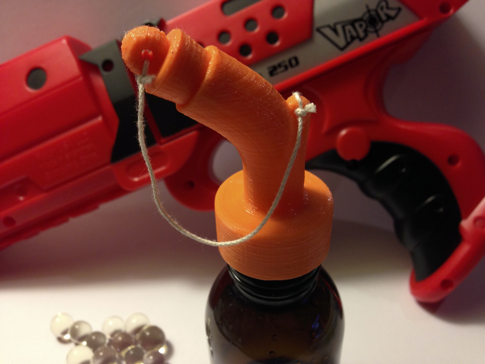
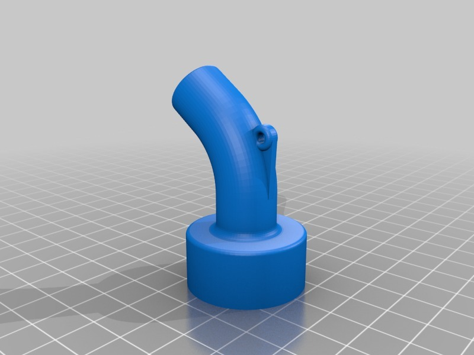
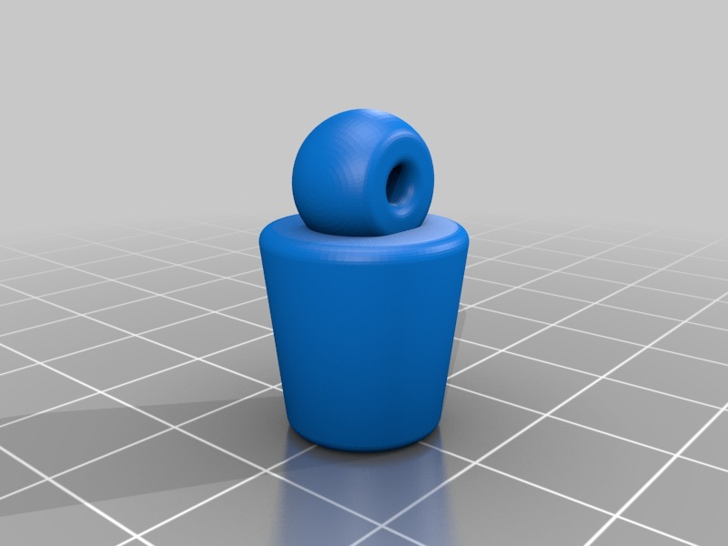

Ammo bottle for Vapor toy gun
===============
**Please note: This thing is part of a list that was [automatically generated](https://github.com/carlosgs/export-things) and may have been updated since then. Make sure to check for the current license and authorship.**  

Ammo bottle for Vapor toy gun  by HamOp , published Feb 23, 2014

Description
--------
My son just got a new Vapor toy gun which shoots small gel balls. In the set, they come in a plastic bag which is not very nice to handle.   
 
As I had some small plastic bottles lying around, I made an ammo bottle for him so he can fill the gun directly from this. I think it's rather cool as it looks a little like a gun powder bottle for an old muzzle loader ;-)

Instructions
--------
Everything prints nicely without support. There are some bridges in the lid, but Slic3r and my printer managed them without any problem.

Files
--------

 [ plug.stl](plug.stl)  

 [ ammo_bottle_lid.stl](ammo_bottle_lid.stl)  

Pictures
--------

Tags
--------
ammo , ammo_bottle , ammunition , toy , Vapor , Vapor_gun  

  

License
--------
Ammo bottle for Vapor toy gun by HamOp is licensed under the Attribution - Non-Commercial - Share Alike license.  

By: Stefan
--------
<https://github.com/HamOP>