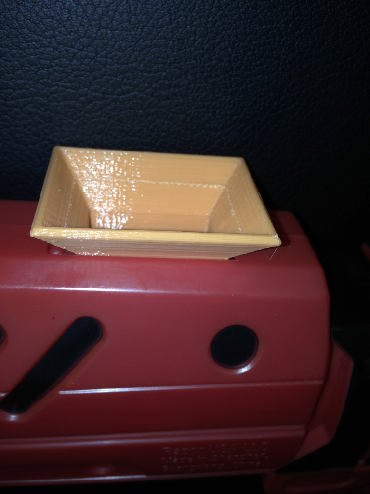
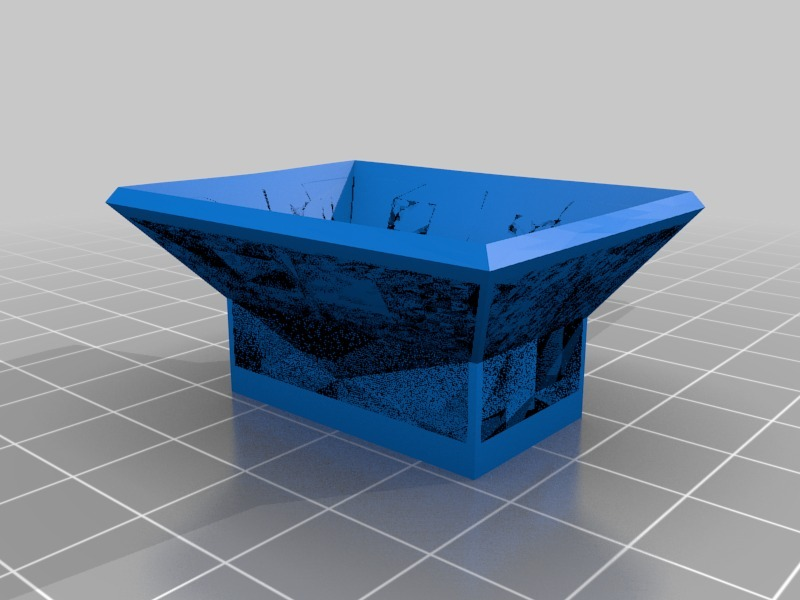

Ammo refill funnel for Vapor toy gun
===============
**Please note: This thing is part of a list that was [automatically generated](https://github.com/carlosgs/export-things) and may have been updated since then. Make sure to check for the current license and authorship.**  

Ammo refill funnel for Vapor toy gun  by HamOp , published Feb 23, 2014

Description
--------
My son just got a Vapor gun which shoots out small gel balls. As the opening for refilling it is rather small, he asked me for a funnel for it.

Instructions
--------
For some reason, Cura tried to print one solid layer in the middle of the part. If that also happens to you, please let me know and I will check the STL again.

Files
--------

 [ Vapor_funnel-V3_repaired.stl](Vapor_funnel-V3_repaired.stl)  

Pictures
--------

Tags
--------
funnel , toy , Vapor , Vapor_gun  

  

License
--------
Ammo refill funnel for Vapor toy gun by HamOp is licensed under the Creative Commons - Attribution - Non-Commercial license.  

By: Stefan
--------
<https://github.com/HamOP>