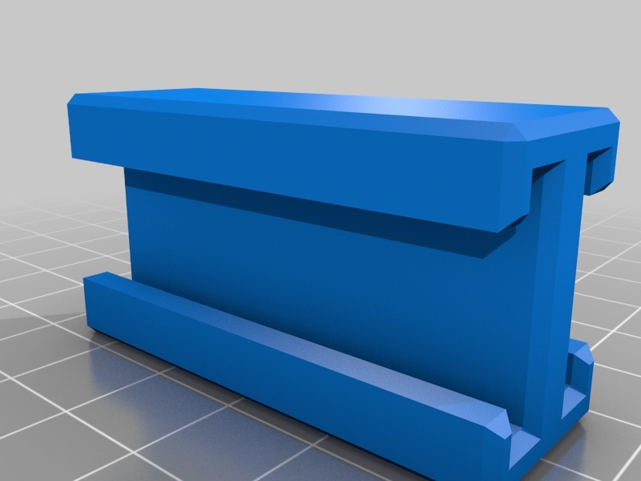
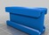

Another NERF dual gun connector
===============
**Please note: This thing is part of a list that was [automatically generated](https://github.com/carlosgs/export-things) and may have been updated since then. Make sure to check for the current license and authorship.**  

Another NERF dual gun connector  by HamOp , published Jan 3, 2014

Description
--------
I was not able to slice the other connector found here, so I made another one. Needs some sanding to fit the particular gun - we found that the rails of the different NERF models have quite differing tolerances.

Instructions
--------
None

Files
--------

 [ dualgunconnector.stl](dualgunconnector.stl)  

Tags
--------
connector , NERF  

  

License
--------
Another NERF dual gun connector by HamOp is licensed under the Creative Commons - Attribution - Non-Commercial license.  

By: Stefan
--------
<https://github.com/HamOP>