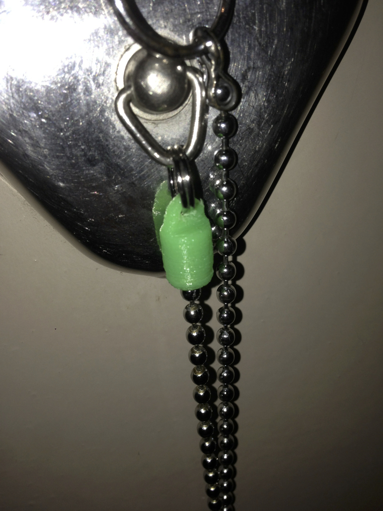
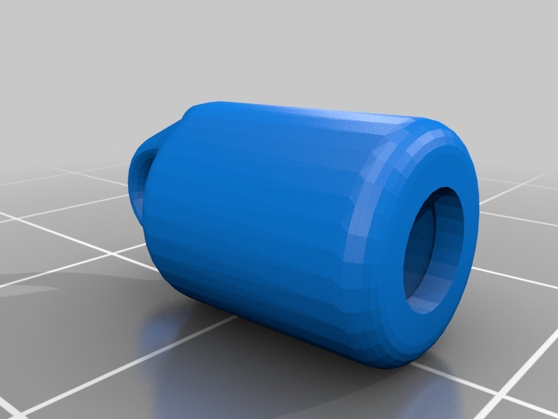

Bath tub chain end piece replacement
===============
**Please note: This thing is part of a list that was [automatically generated](https://github.com/carlosgs/export-things) and may have been updated since then. Make sure to check for the current license and authorship.**  

Bath tub chain end piece replacement  by HamOp , published Feb 16, 2014

Description
--------
The part that fixed the chain of the plug on our bath tub is broken, so I designed a simple replacement. I glued the chain into the thing with some hot glue - it will stay there because there is a small step in the part.

Instructions
--------
None

Files
--------

 [ Kettenhalter_Badewanne-V4.stl](Kettenhalter_Badewanne-V4.stl)  

Pictures
--------

Tags
--------
None  

  

License
--------
Bath tub chain end piece replacement by HamOp is licensed under the Creative Commons - Attribution - Non-Commercial license.  

By: Stefan
--------
<https://github.com/HamOP>