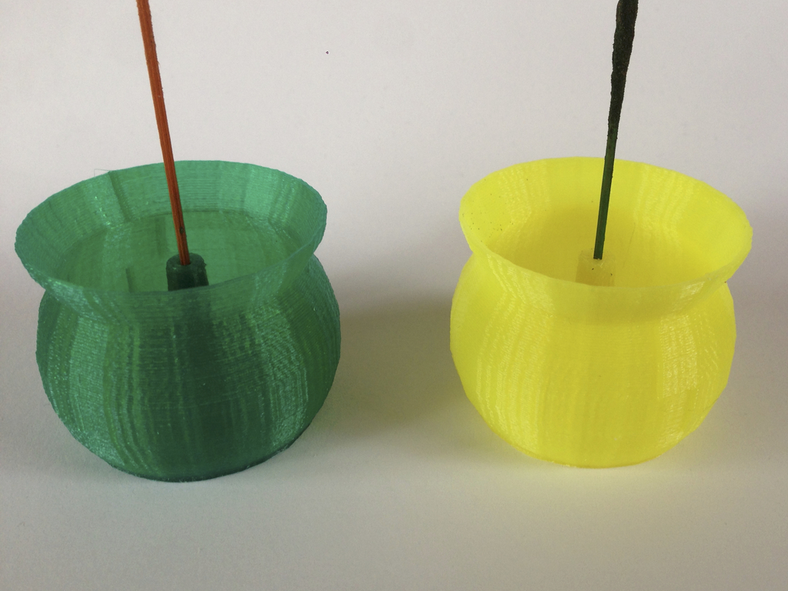
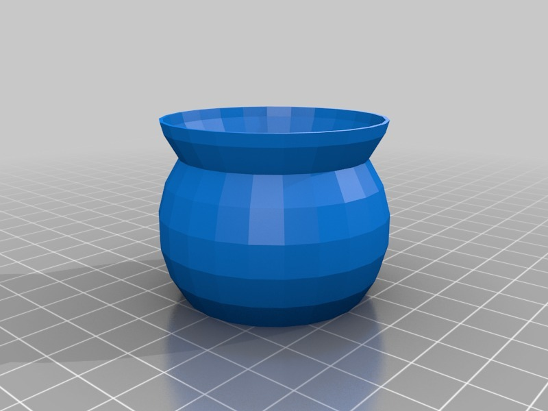

Catch XL
===============
**Please note: This thing is part of a list that was [automatically generated](https://github.com/carlosgs/export-things) and may have been updated since then. Make sure to check for the current license and authorship.**  

Catch XL  by HamOp , published Feb 1, 2014

Description
--------
ibudmen's Catch didn't let me go. As we found it a little bit too small to catch all the ashes (and not to get knocked over by our children all the time ;-) ), I already had tried to make a bigger one in Inventor fusion (http://www.thingiverse.com/thing:224721) which was nice, but not as beautiful als the original one (http://www.thingiverse.com/thing:75477).    
 
Now, I played around in OpenScad and made another one which is closer to the original, but about twice the size.

Instructions
--------
Just print it. Translucent PLA looks great!

Files
--------

 [ Catch_XL.stl](Catch_XL.stl)  

Pictures
--------

Tags
--------
ash , ashes , candle , catch , catcher , holder , incense , incense_holder  

  

License
--------
Catch XL by HamOp is licensed under the Creative Commons - Attribution - Non-Commercial license.  

By: Stefan
--------
<https://github.com/HamOP>