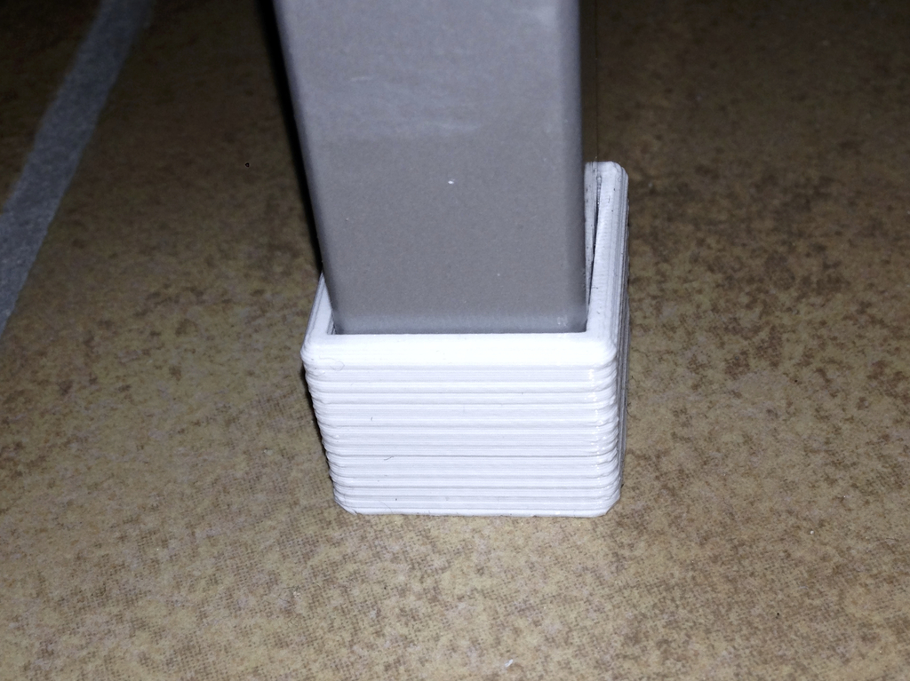
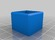
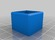
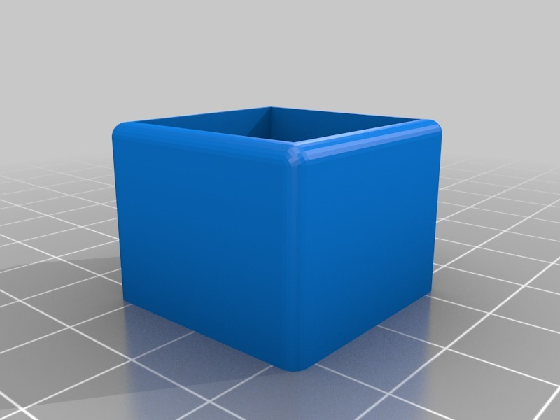
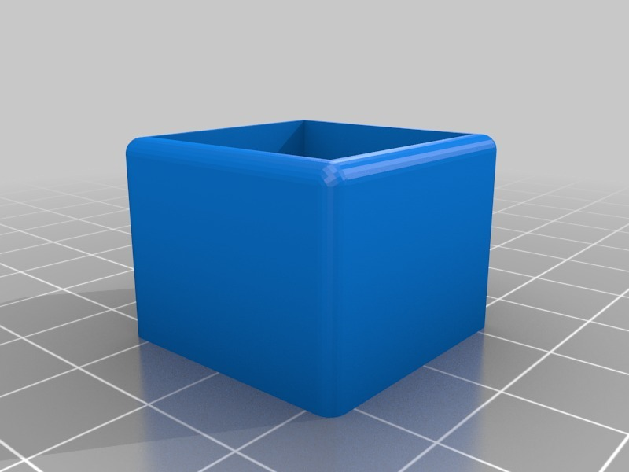

Closet leveling feet for IKEA PS closet
===============
**Please note: This thing is part of a list that was [automatically generated](https://github.com/carlosgs/export-things) and may have been updated since then. Make sure to check for the current license and authorship.**  

Closet leveling feet for IKEA PS closet  by HamOp , published Jan 3, 2014

Description
--------
I have an IKEA PS metal closet in my workshop and the floor is not even - so I designed those small extensions to level it.

Instructions
--------
None

Files
--------

 [ Fu_8mm.stl](Fu_8mm.stl)  

 [ Fu_14mm.f3d](Fu_14mm.f3d)  

 [ Fu_8mm.f3d](Fu_8mm.f3d)  

 [ Fu_14mm.stl](Fu_14mm.stl)  

Pictures
--------

Tags
--------
closet , foot , furniture , level  

  

License
--------
Closet leveling feet for IKEA PS closet by HamOp is licensed under the Creative Commons - Attribution - Non-Commercial license.  

By: Stefan
--------
<https://github.com/HamOP>