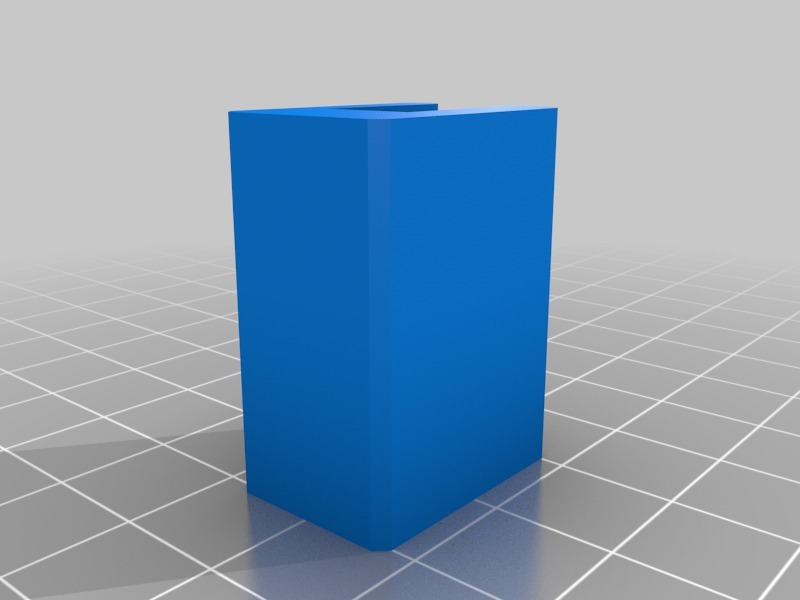

Customized Heat bed clamp for K8200 and IKEA mirror
===============
**Please note: This thing is part of a list that was [automatically generated](https://github.com/carlosgs/export-things) and may have been updated since then. Make sure to check for the current license and authorship.**  

Customized Heat bed clamp for K8200 and IKEA mirror  by HamOp , published Jan 13, 2014

Description
--------
Customized version of <a href="http://www.thingiverse.com/thing:217029" target="_blank" rel="nofollow">thingiverse.com/thing:217029</a> 
 
Created with Customizer! <a href="http://www.thingiverse.com/apps/customizer/run?thing_id=217029" target="_blank" rel="nofollow">thingiverse.com/apps/customizer/run?thing_id=217029</a> 
 

Instructions
--------
Using the following options: 
 
laenge = 30 
harmtop = 3.6 
warmbottom = 14 
hbed = 7 
harmbottom = 5 
warmtop = 14 
wbase = 8 

Files
--------

 [ bettklammersmuk_20140113-19506-bk1ncj-0.stl](bettklammersmuk_20140113-19506-bk1ncj-0.stl)  

Tags
--------
customized  

  

License
--------
Customized Heat bed clamp for K8200 and IKEA mirror by HamOp is licensed under the Creative Commons - Attribution - Non-Commercial license.  

By: Stefan
--------
<https://github.com/HamOP>