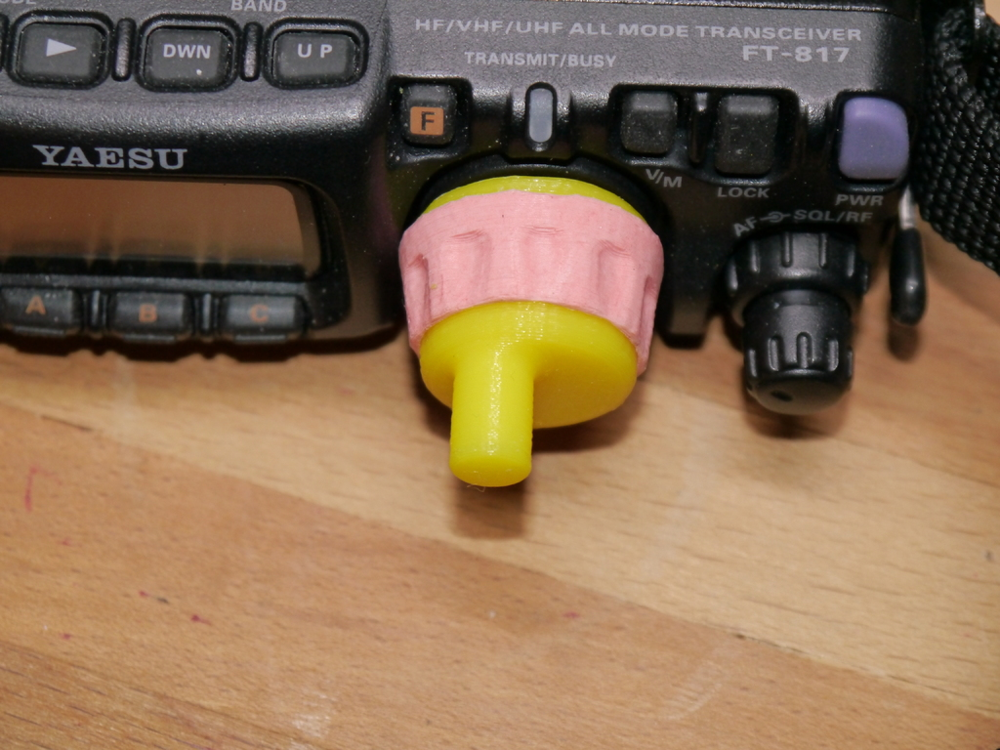
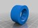
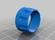
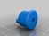
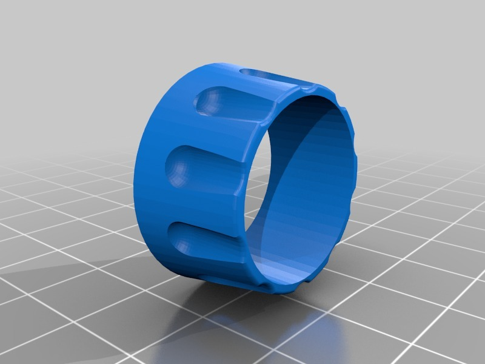
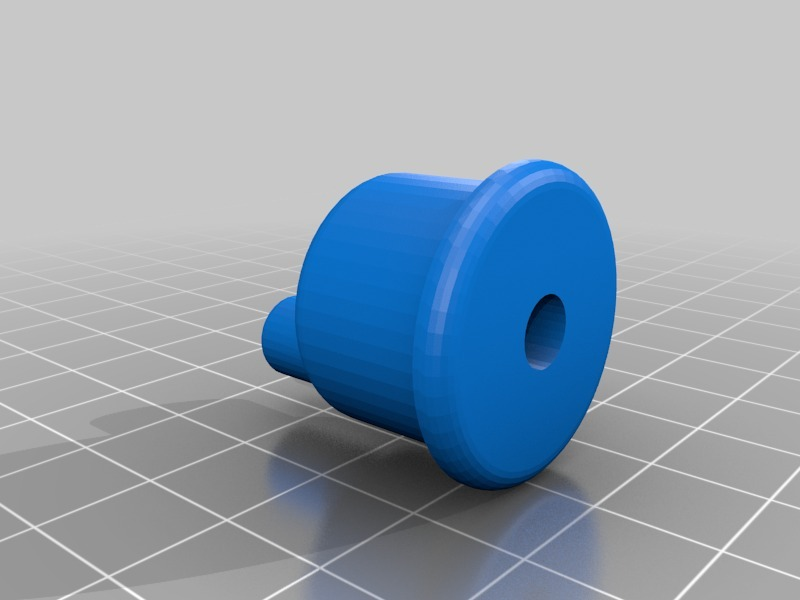
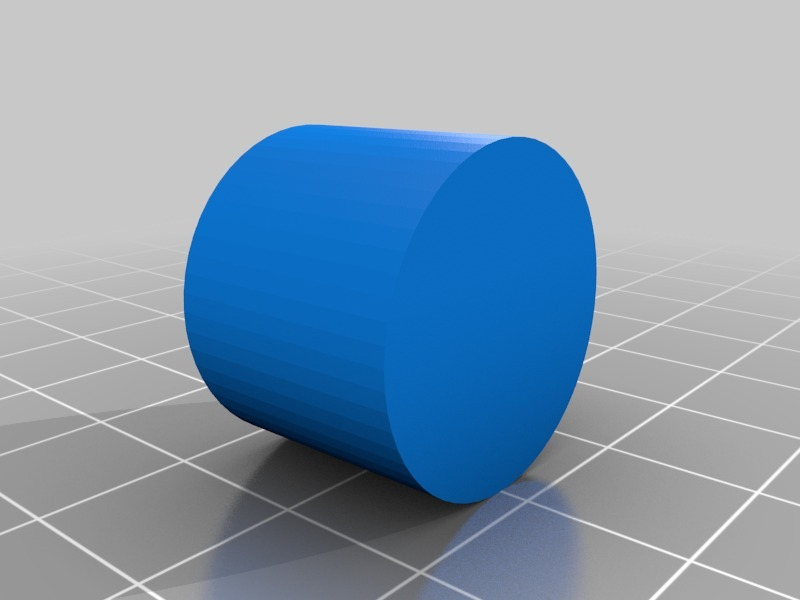
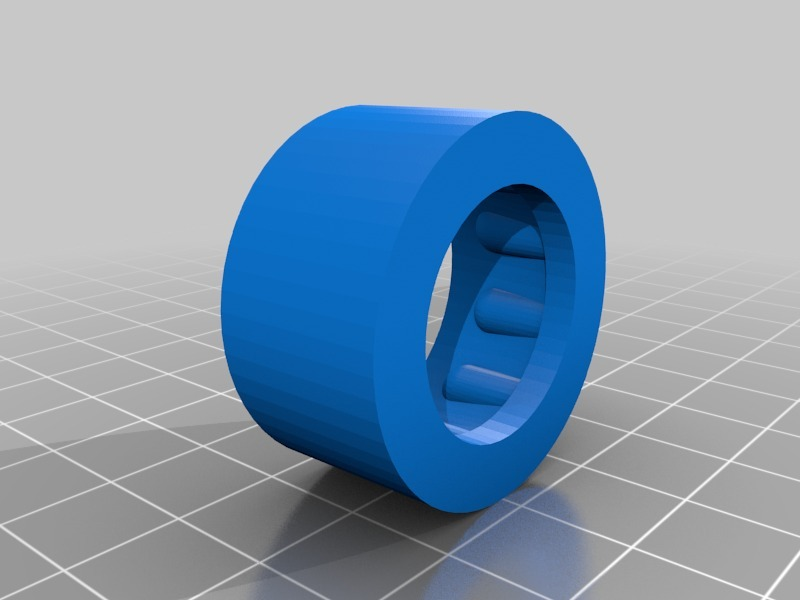
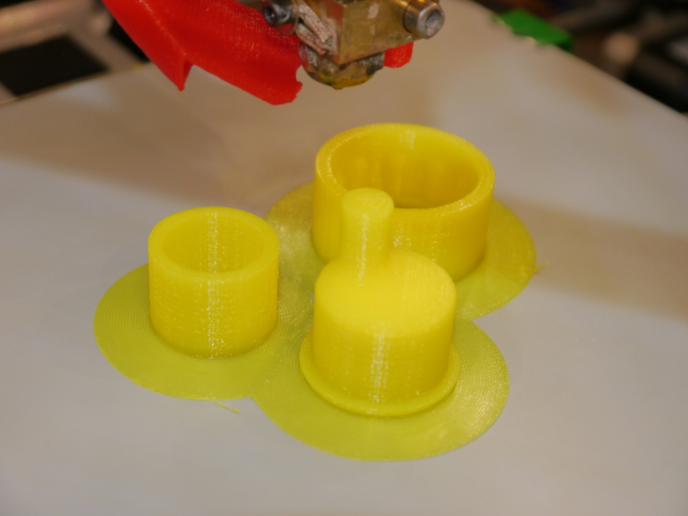
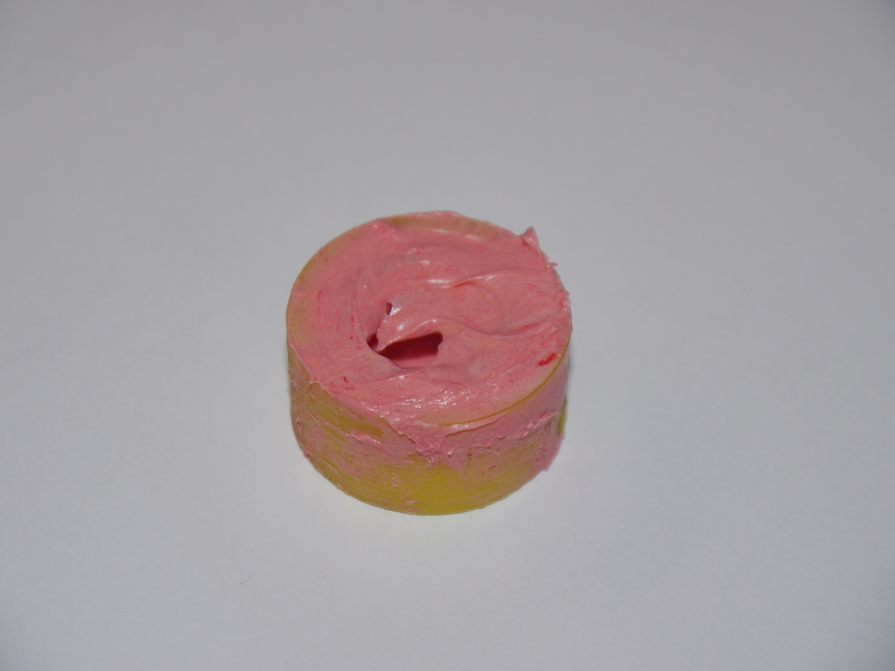

FT-817 crank knob with custom Oogoo sleeve
===============
**Please note: This thing is part of a list that was [automatically generated](https://github.com/carlosgs/export-things) and may have been updated since then. Make sure to check for the current license and authorship.**  

FT-817 crank knob with custom Oogoo sleeve  by HamOp , published Jan 31, 2014

Description
--------
I didn't really like the rather hard rubber surface of the original knob and wanted a crank anyway, so I made a crank knob and a fitting Oogoo mold to make a softer rubber sleeve for it. I also included an STL of the rubber sleeve if you want to try printing it with flexible filament. The diameter of the sleeve is 1 mm smaller than the knob to create a tight fit.   
 
Update: This thing is featured in the August edition of the DARC (German Amateur Radio Club) magazine CQDL: <a href="http://www.darc.de/cq-dl/" target="_blank" rel="nofollow">darc.de/cq-dl/</a>

Instructions
--------
Printable without support, axle hole down for the knob - the bridge there was no problem in my print.    
You may have to sand down part 2 of the mold a bit so that it fits snuggly into part 1. Fill with Oogoo to your taste and let it set. I thinned the Oogoo with a little bit of cleaning solvent to make it softer. To fully fill the mold and avoid air bubbles, for me it was better to fill the outer mold first and then drive the inner part in in as the walls of the Oogoo part itself will be very thin. When it is dry, you can easily remove the inner part of the mold again and get a nice rubber sleeve for your custom made knob.   
On the knob, thread the screw hole with an M3 screw and insert the original screw from the old knob. Sand the axle hole to make it fit the axle and attach the knob with the screw. Put on the Oogoo sleeve and gd DX!

Files
--------

 [ FT-817_knob_rubber_mold_part1.stl](FT-817_knob_rubber_mold_part1.stl)  

 [ FT-817_knob_rubber.stl](FT-817_knob_rubber.stl)  

 [ FT-817_knob.stl](FT-817_knob.stl)  

 [ FT-817_knob_rubber_mold_part2.stl](FT-817_knob_rubber_mold_part2.stl)  

Pictures
--------

Tags
--------
Amateur_Radio , crank , FT-817 , FT817 , HAM , HAM_Radio  

  

License
--------
FT-817 crank knob with custom Oogoo sleeve by HamOp is licensed under the Creative Commons - Attribution - Non-Commercial license.  

By: Stefan
--------
<https://github.com/HamOP>