Filament coil holder for K8200
===============
**Please note: This thing is part of a list that was [automatically generated](https://github.com/carlosgs/export-things) and may have been updated since then. Make sure to check for the current license and authorship.**  

Filament coil holder for K8200  by HamOp , published Jan 5, 2014

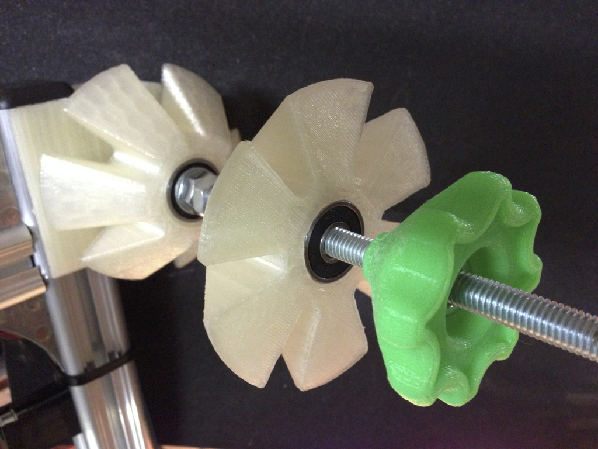

Description
--------
As I only have some 608 ball bearings for an 8 mm shaft, I thought it would be fun to create my own filament coil holder. The two cones are supported by two 608 ball bearings each. In the hand wheel, an M6 nut is inserted to fix the whole thing.   
 
Added a version 2 of the hand wheel which is a little smaller and easier to grab as it has more clearance to the coil cone.   
 
I you are looking for the right bearings - I recycled mine from a pair of old rollerblades ;-)   
 
Update: I'm still very happy with this fixture. Coil turns smoothly and centers nicely. No need to change anything.   
 
Update: Added a smaller version of the coin cone for coils down to approx. 25 mm inner diameter.

Instructions
--------
You will need the "coil cone" twice - on this part, some support for the bearing mount on the bottom will be necessary. Infill at 10 - 15% should be OK for these big parts.  Printed mine at 15% if I remember right.   
 
The holder should be printed with higher infill - I used 25% to make it strong enough to hold a 1 kg filament spool.   
 
For printing the hand wheel, I used support as I had some issues with the overhangs bending up when trying to print without.

Files
--------
[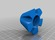](Coil_Cone_small.stl)
 [ Coil_Cone_small.stl](Coil_Cone_small.stl)  

 [ Hand_Wheel_V2.stl](Hand_Wheel_V2.stl)  

[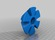](Coil_Cone.stl)
 [ Coil_Cone.stl](Coil_Cone.stl)  

[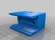](Holder.stl)
 [ Holder.stl](Holder.stl)  

 [ Hand_Wheel.stl](Hand_Wheel.stl)  

Pictures
--------
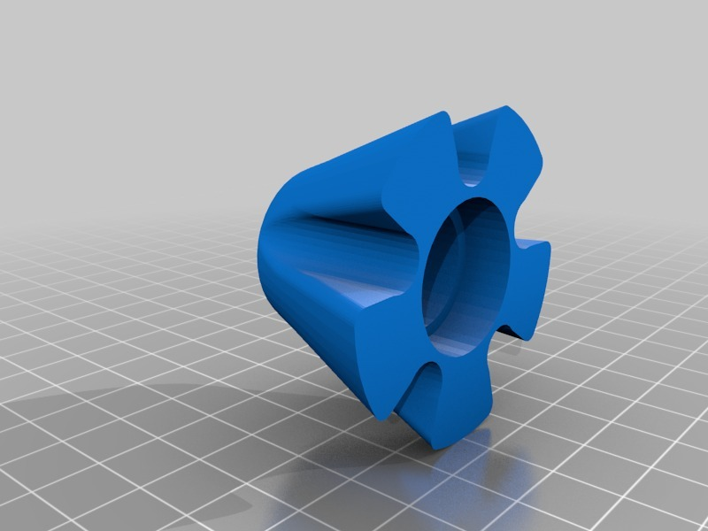
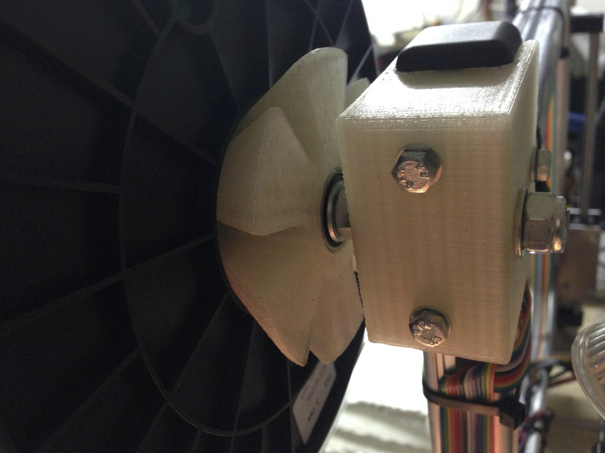
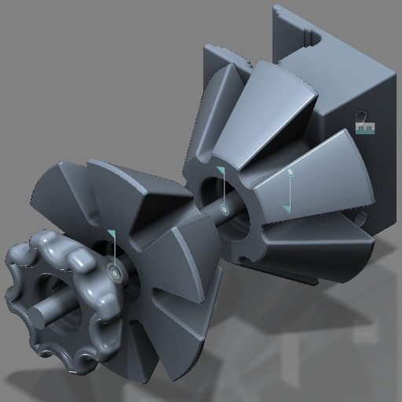
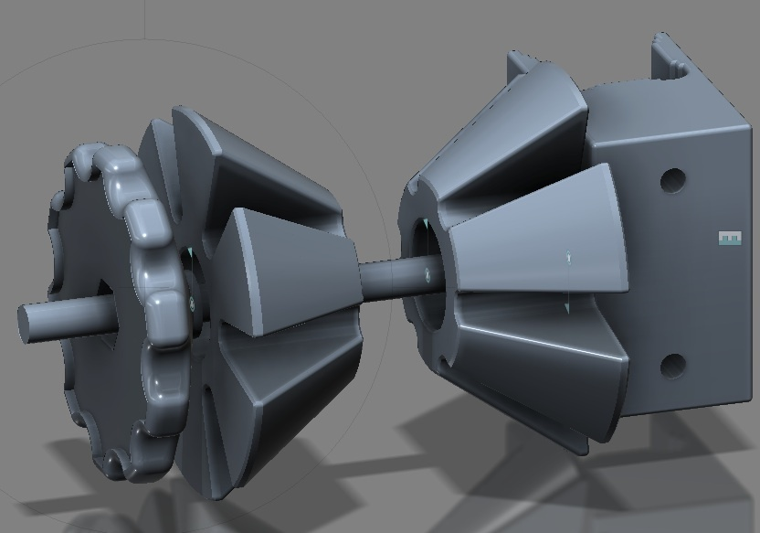
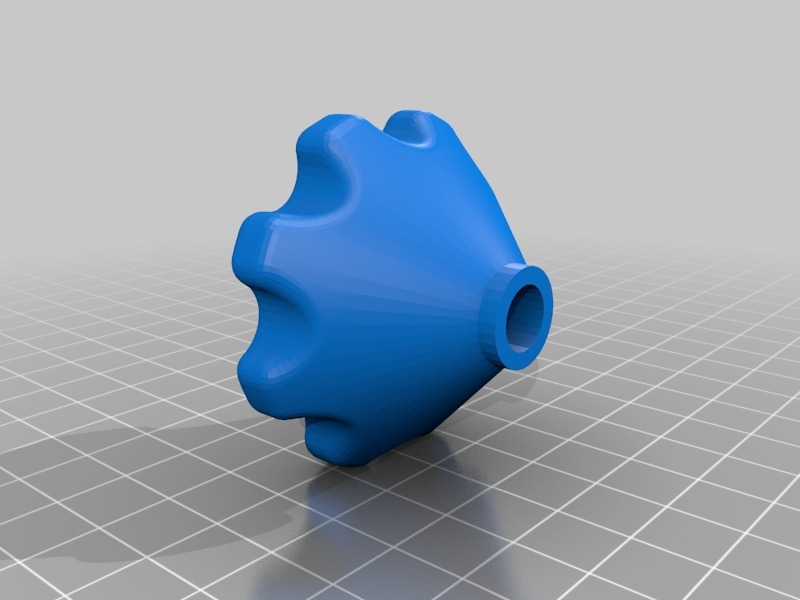
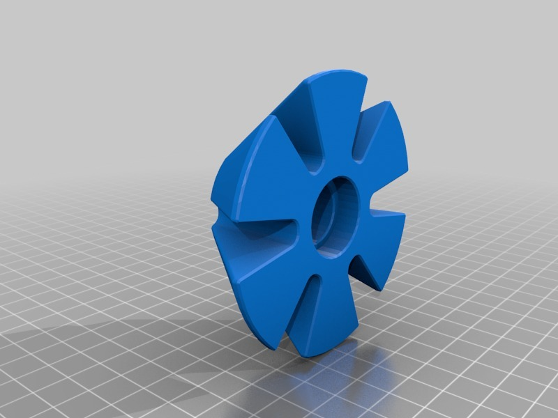
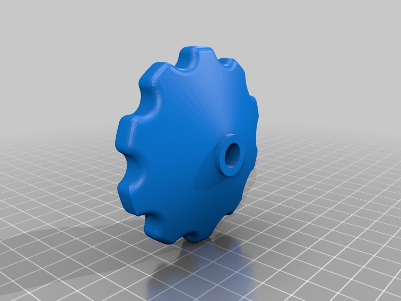
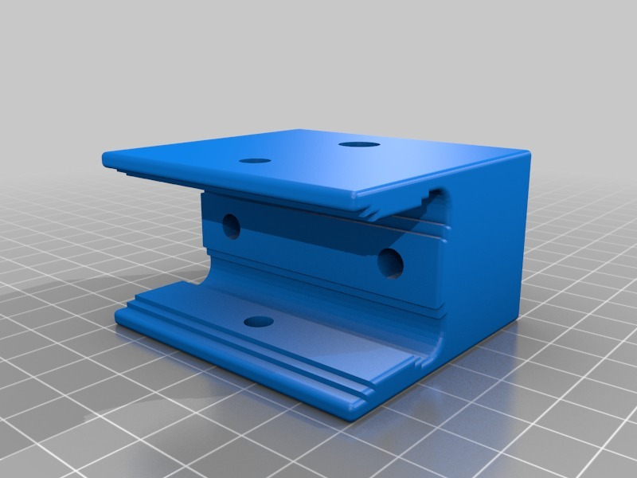

Tags
--------
filament , K8200 , spool_holder  

  

License
--------
Filament coil holder for K8200 by HamOp is licensed under the Creative Commons - Attribution - Non-Commercial license.  

By: Stefan
--------
<https://github.com/HamOP>