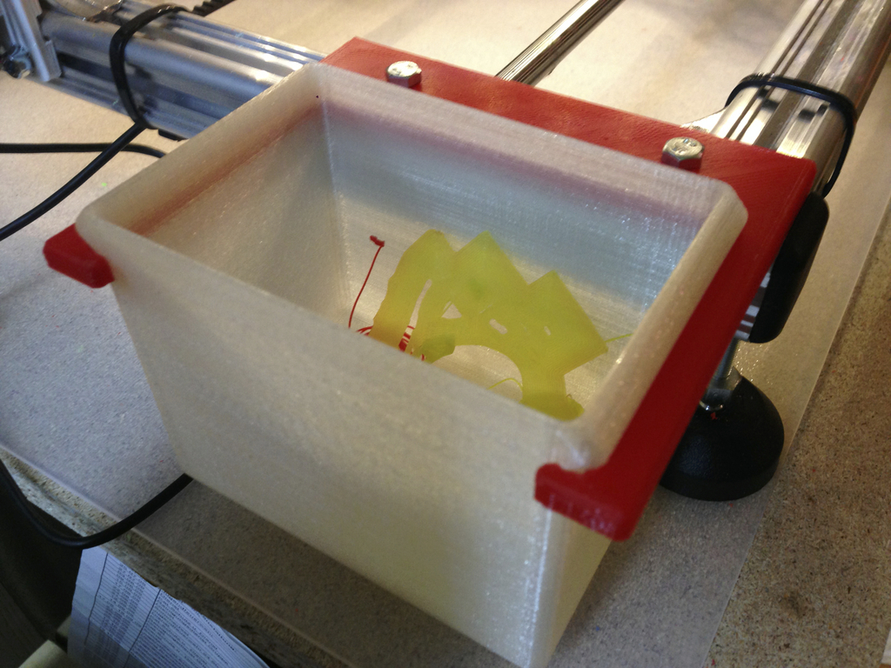
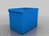
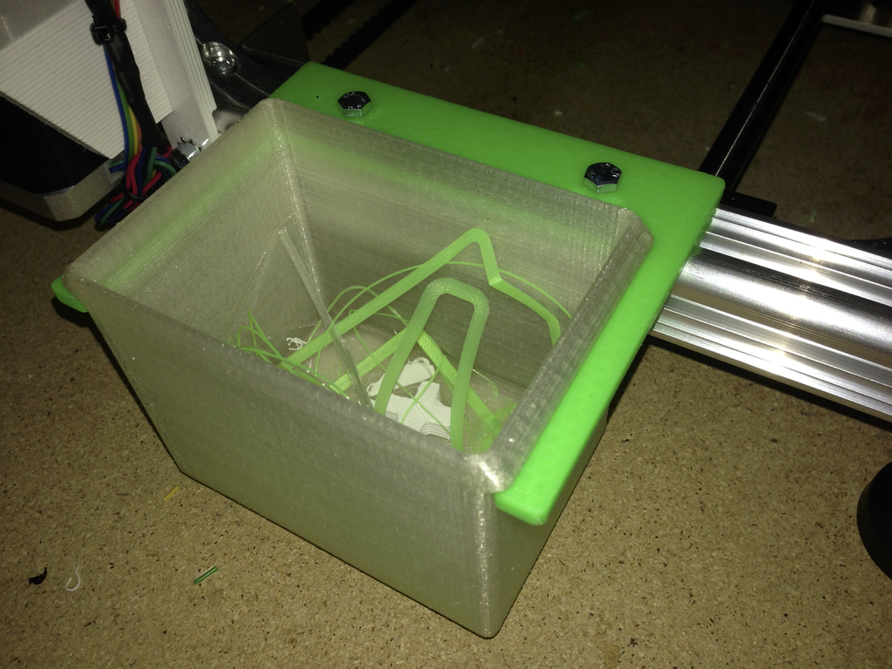
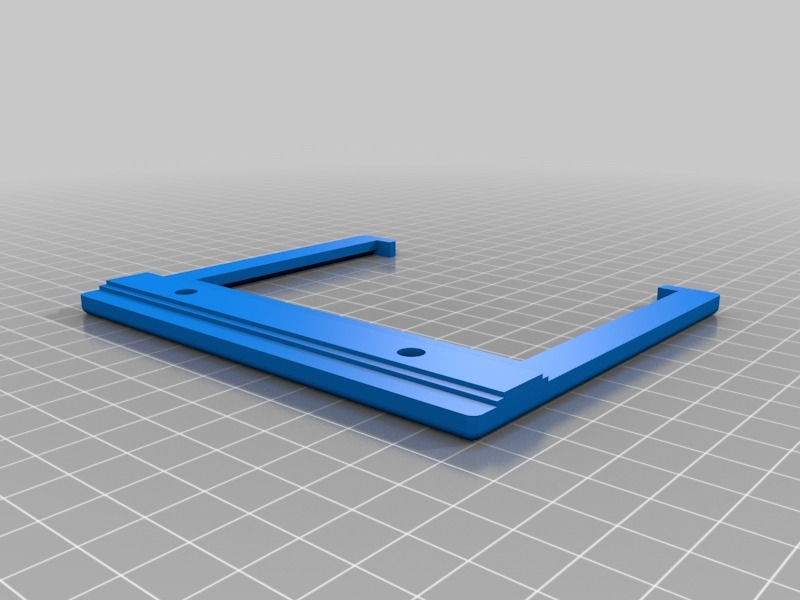
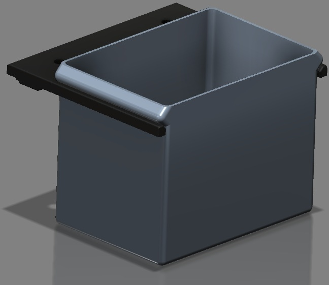
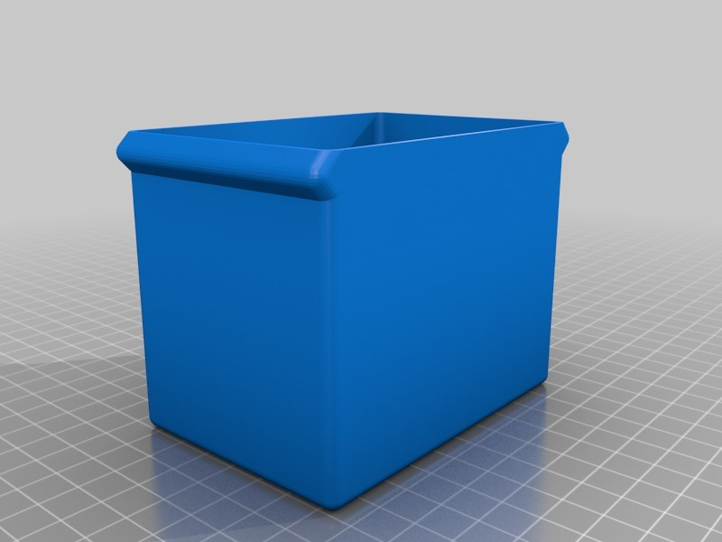
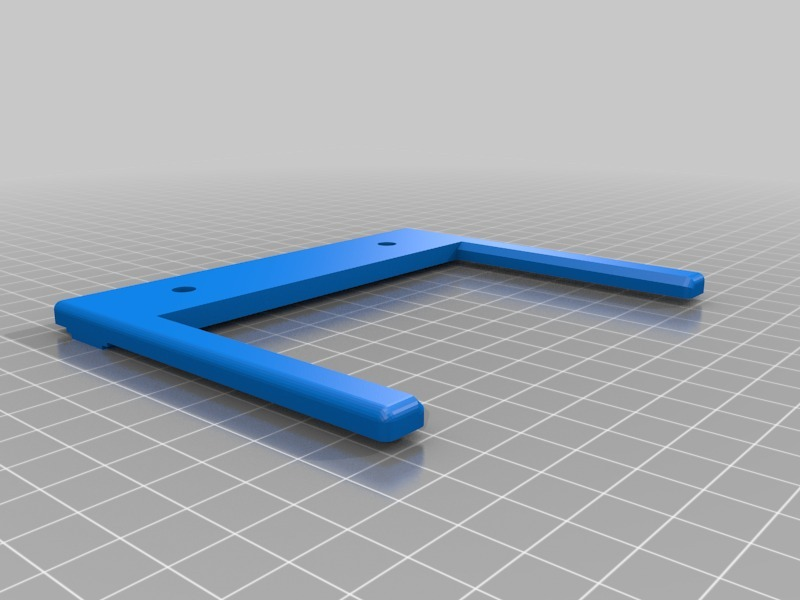

Filament garbage bin for K8200
===============
**Please note: This thing is part of a list that was [automatically generated](https://github.com/carlosgs/export-things) and may have been updated since then. Make sure to check for the current license and authorship.**  

Filament garbage bin for K8200  by HamOp , published Jan 5, 2014

Description
--------
I liked the idea of FOmenal's recup box, so i designed one for my K8200. Thanks for the inspiration!   
 
The holder fits onto the extruded aluminium profile of the printer and is fixed with two M5x10 bolts.   
 
Update: Added a second holder for the bin which has two notches to keep the bin in place a little better. As you now will have to slide in the bin from the top, I also opened the clearance between the holder and the bin a little bit. It fits perfectly!

Instructions
--------
Print holder upside down so you will need no support.   
 
The bin can simply be printed as it is. As the walls are very thin and the part is quite large, a brim is recommended to increase adhesion to the heat bed.

Files
--------

 [ Halter_V2.stl](Halter_V2.stl)  

 [ Eimer.stl](Eimer.stl)  

 [ Halter.stl](Halter.stl)  

Pictures
--------

Tags
--------
accessory , cleanup , helper , K8200 , tidy  

  

License
--------
Filament garbage bin for K8200 by HamOp is licensed under the Creative Commons - Attribution - Non-Commercial license.  

By: Stefan
--------
<https://github.com/HamOP>