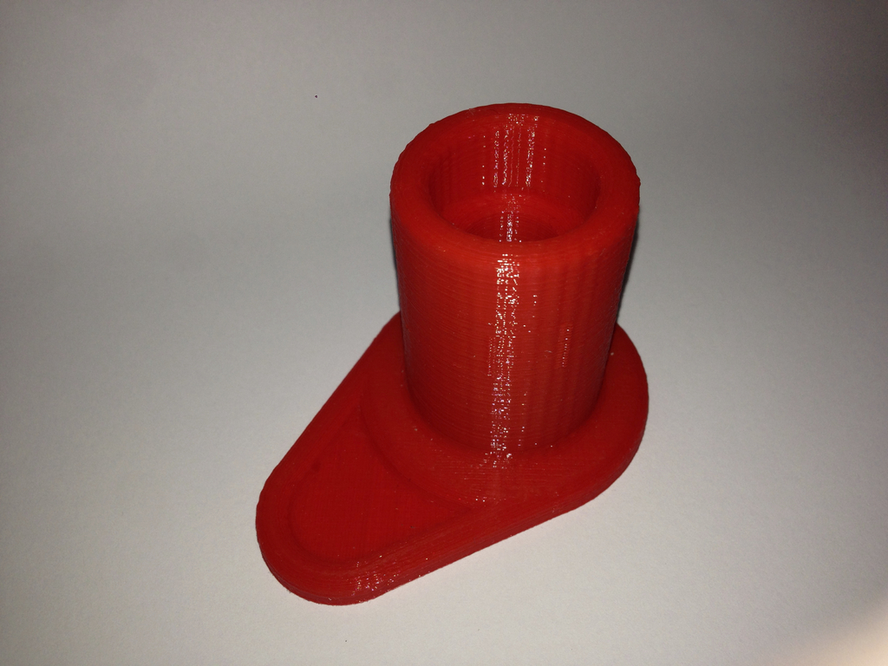
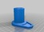
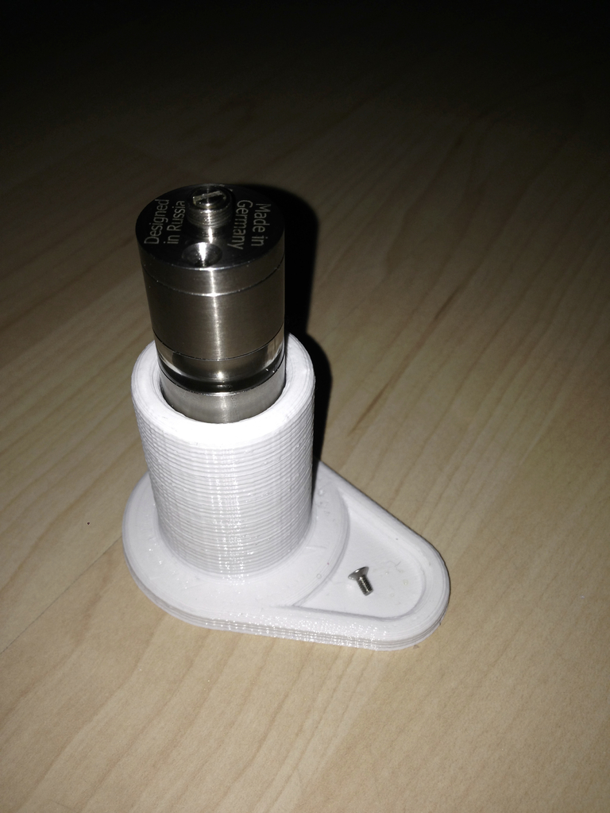
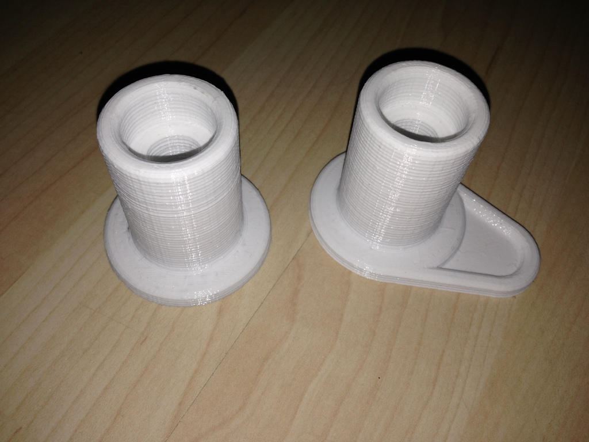
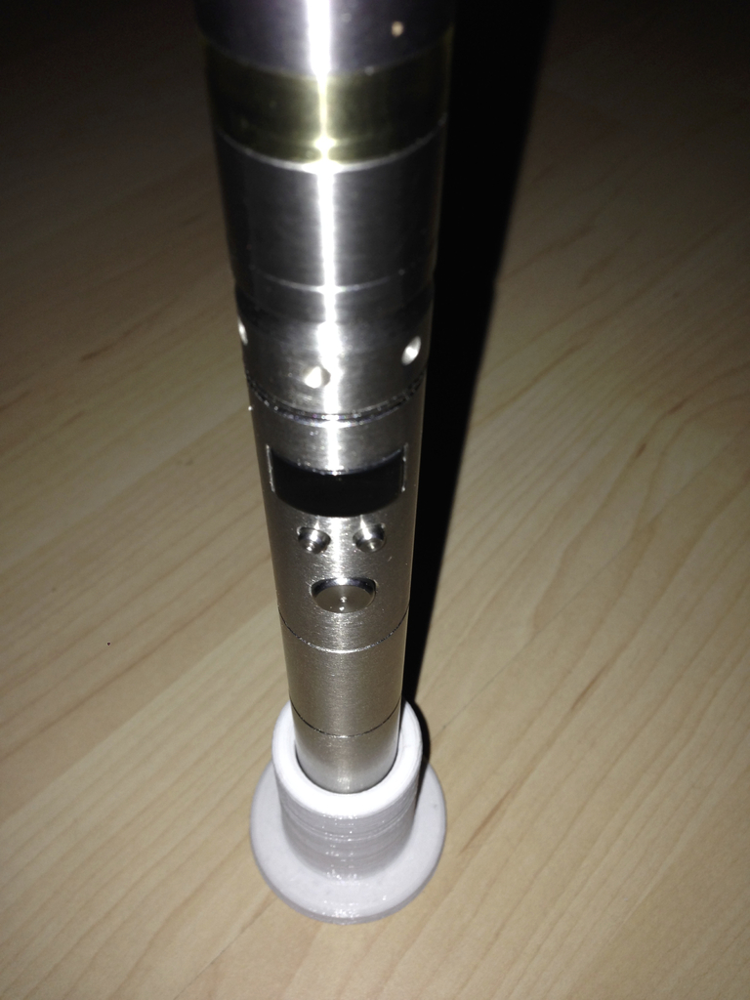
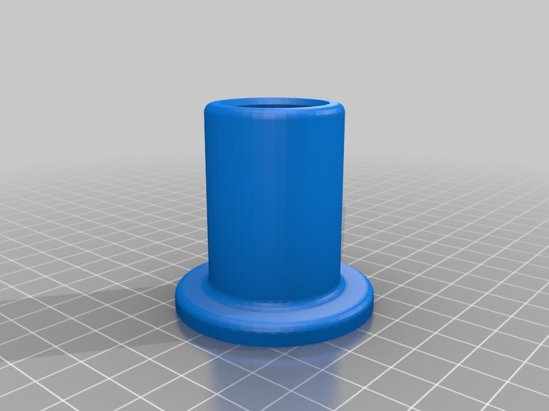
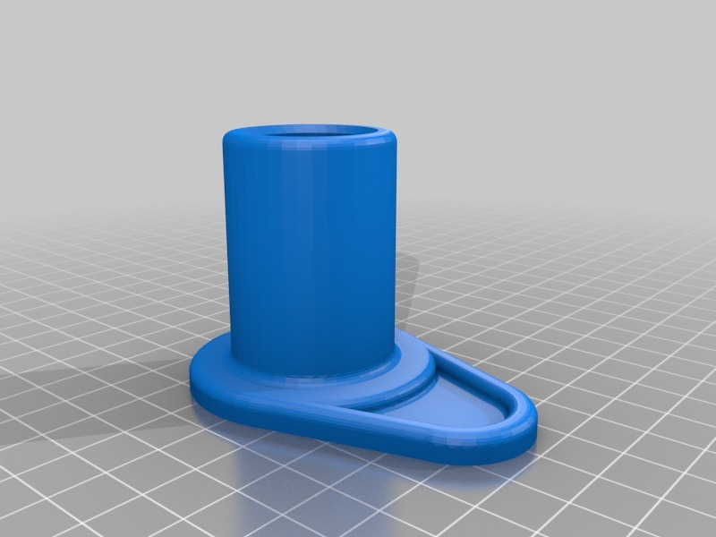
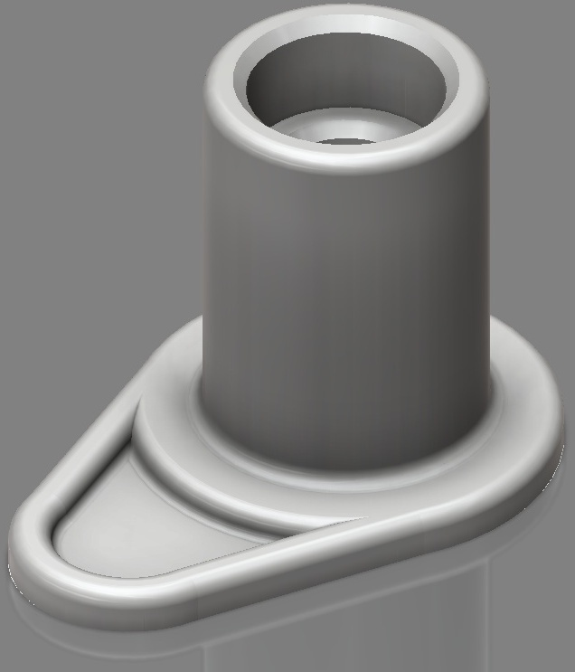
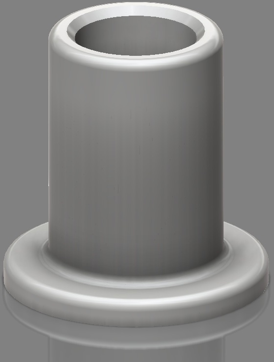

Filling stand for Kayfun (lite) E-Cig atomizer
===============
**Please note: This thing is part of a list that was [automatically generated](https://github.com/carlosgs/export-things) and may have been updated since then. Make sure to check for the current license and authorship.**  

Filling stand for Kayfun (lite) E-Cig atomizer  by HamOp , published Jan 3, 2014

Description
--------
The Kayfun and Kayfun lite E-cigarette atomizers are filled with E-liquid from the bottom through a small screw hole. I created this small stand to be able to position the atomizer upside-down without the need of disassembling the mouth piece or needing a third hand for the refill.   
 
Version 2 includes a tray feature for keeping the small screw that normally closes the filling hole while it is removed.   
 
Inventor files can be posted if needed.

Instructions
--------
Should be a quite easy print - no support needed. Print at about 25% infill and 3-4 solid top layers.

Files
--------

 [ Filling_Stand_Kayfun.stl](Filling_Stand_Kayfun.stl)  

 [ Filling_Stand_Kayfun_V2.stl](Filling_Stand_Kayfun_V2.stl)  

Pictures
--------

Tags
--------
e-cig , e-cigarette , e-smoking , Electronic_Cigarette , stand  

  

License
--------
Filling stand for Kayfun (lite) E-Cig atomizer by HamOp is licensed under the Creative Commons - Attribution - Non-Commercial license.  

By: Stefan
--------
<https://github.com/HamOP>