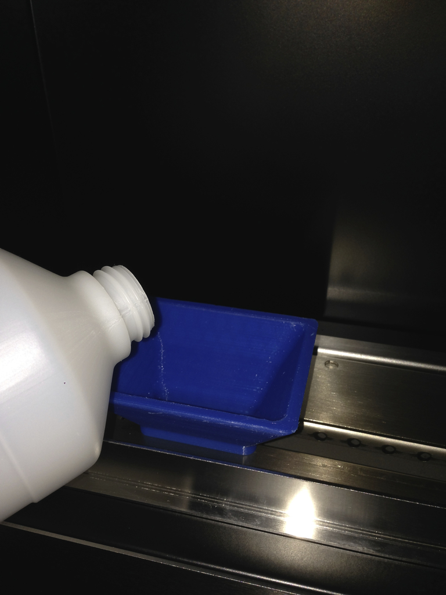
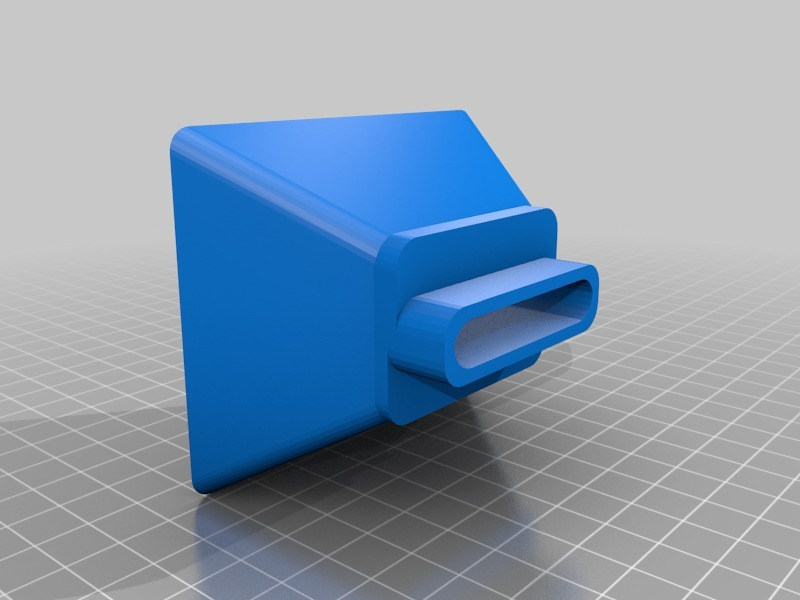
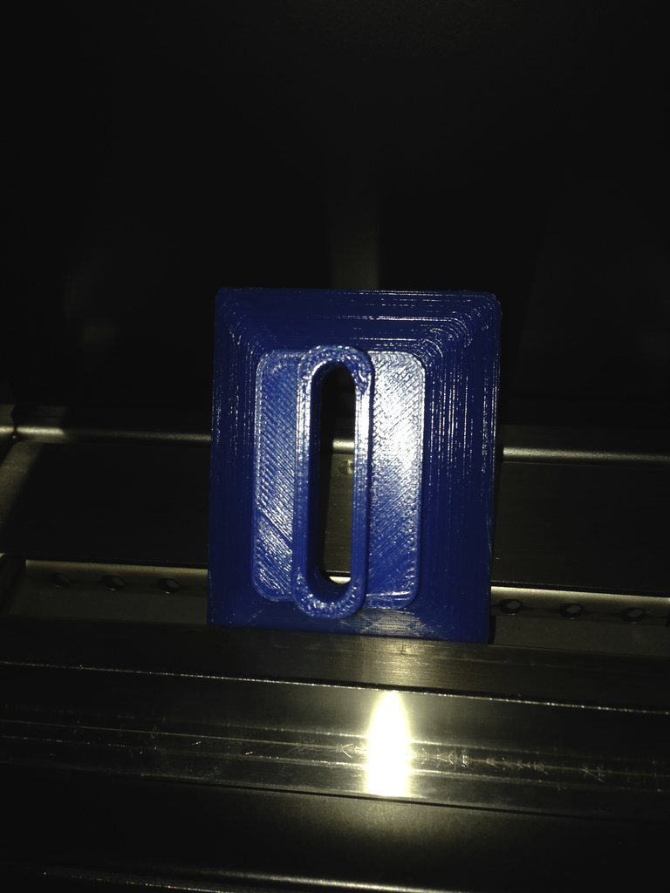

Funnel for ethanol fireplace
===============
**Please note: This thing is part of a list that was [automatically generated](https://github.com/carlosgs/export-things) and may have been updated since then. Make sure to check for the current license and authorship.**  

Funnel for ethanol fireplace  by HamOp , published Mar 4, 2014

Description
--------
In our town, a big hardware store is closing and so I got an ethanol fireplace from there for a really great price. It's a nice addition to our living room and makes it even more cosy. The only thing that annoys me is filling up the ethanol tank as it only has a rather small opening which makes it very hard not to spill the fluid all over the place.   
 
So, I fired up the 3D printer and made a simple funnel which exactly fits onto the burner slit and makes filling up a breeze. As the burner is not completely flat, I cut out the bottom to make it stand stable.   
 
Let's see how long the PLA will withstand the ethanol of if it will degrade over time.

Instructions
--------
Printed in PLA, 0.3 mm layer, 20% infill.

Files
--------

 [ Trichter_Ethanol-Kamin.stl](Trichter_Ethanol-Kamin.stl)  

Pictures
--------

Tags
--------
ethanol , fireplace , funnel , refill  

  

License
--------
Funnel for ethanol fireplace by HamOp is licensed under the Creative Commons - Attribution - Non-Commercial license.  

By: Stefan
--------
<https://github.com/HamOP>