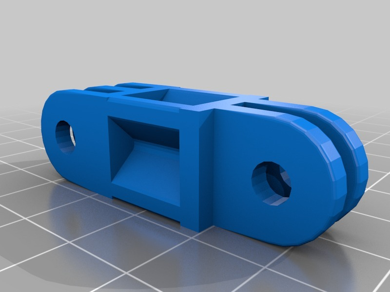
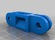

GoPro Arm 35mm not twisted
===============
**Please note: This thing is part of a list that was [automatically generated](https://github.com/carlosgs/export-things) and may have been updated since then. Make sure to check for the current license and authorship.**  

GoPro Arm 35mm not twisted  by HamOp , published Mar 20, 2014

Description
--------
Customized version of <a href="http://www.thingiverse.com/thing:62800" target="_blank" rel="nofollow">thingiverse.com/thing:62800</a> 
 
Created with Customizer! <a href="http://www.thingiverse.com/apps/customizer/run?thing_id=62800" target="_blank" rel="nofollow">thingiverse.com/apps/customizer/run?thing_id=62800</a> 
 

Instructions
--------
Using the following options: 
 
gopro_captive_rod_id = 3.8 
gopro_rod_nut_th = 3.6 
gopro_bar_th = 3.2 
gopro_rod_nut_od = 8.05 
gopro_bar_screw_d = 3 
gopro_ext_len = 35 
gopro_bar_screw_shoulder_th = 4.5 
gopro_ext_th = 3 
gopro_bar_gap = 2.4 
gopro_secondary_rotated = 0 
gopro_primary = double 
gopro_bar_rod_d = 31 
gopro_captive_protruding_h = 0.5 
gopro_captive_rod_angle = 45 
gopro_secondary_what = triple 
gopro_bar_screw_nut_d = 6.01 
gopro_bar_screw_head_d = 6.2 

Files
--------

 [ gopro_mounts_mooncactus_20140320-13164-1hq7ree-0.stl](gopro_mounts_mooncactus_20140320-13164-1hq7ree-0.stl)  

Tags
--------
customized  

  

License
--------
GoPro Arm 35mm not twisted by HamOp is licensed under the Creative Commons - Attribution - Non-Commercial license.  

By: Stefan
--------
<https://github.com/HamOP>