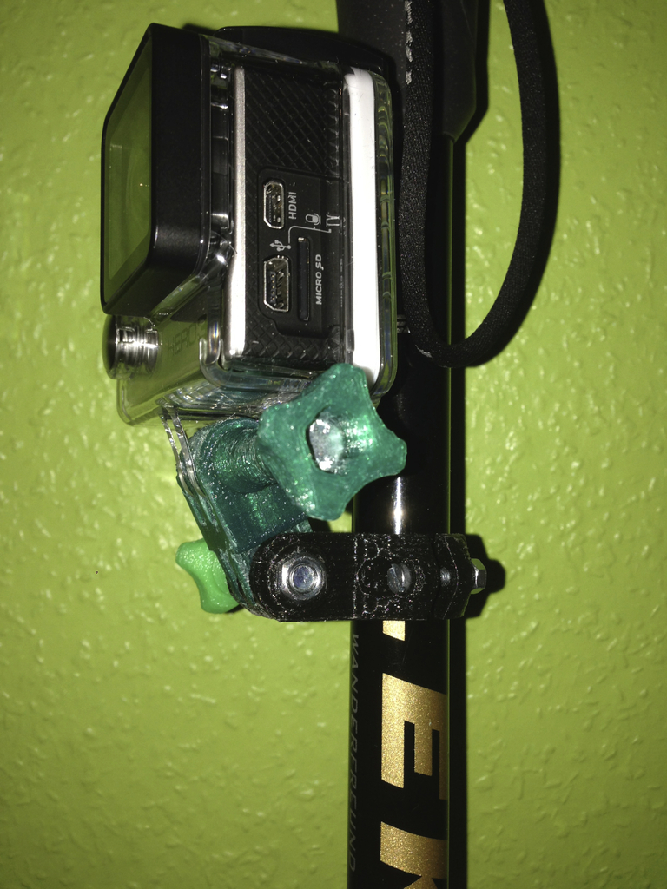
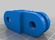
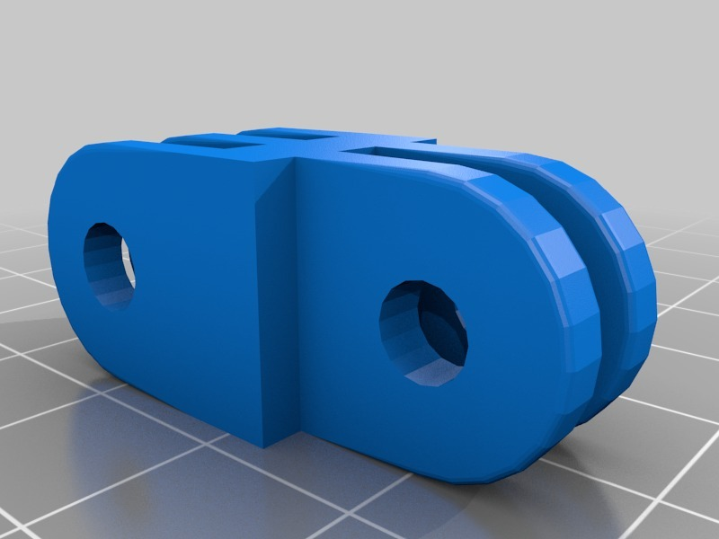

GoPro Arm short not twisted
===============
**Please note: This thing is part of a list that was [automatically generated](https://github.com/carlosgs/export-things) and may have been updated since then. Make sure to check for the current license and authorship.**  

GoPro Arm short not twisted  by HamOp , published Mar 20, 2014

Description
--------
You can use this to mount the camera perpendicular to a normal base it that's not possible because the housing it too thick. I use it with <a href="http://www.thingiverse.com/thing:278983" target="_blank" rel="nofollow">thingiverse.com/thing:278983</a>, for example.   
 
Customized version of <a href="http://www.thingiverse.com/thing:62800" target="_blank" rel="nofollow">thingiverse.com/thing:62800</a>  
 
Created with Customizer! <a href="http://www.thingiverse.com/apps/customizer/run?thing_id=62800" target="_blank" rel="nofollow">thingiverse.com/apps/customizer/run?thing_id=62800</a>  

Instructions
--------
Using the following options:   
 
gopro_bar_rod_d = 31   
gopro_bar_screw_head_d = 6.2   
gopro_rod_nut_th = 3.6   
gopro_bar_gap = 2.4   
gopro_bar_screw_d = 3   
gopro_secondary_rotated = 0   
gopro_primary = double   
gopro_bar_th = 3.2   
gopro_captive_rod_angle = 45   
gopro_captive_rod_id = 3.8   
gopro_captive_protruding_h = 0.5   
gopro_ext_th = 3   
gopro_bar_screw_shoulder_th = 4.5   
gopro_bar_screw_nut_d = 6.01   
gopro_ext_len = 21   
gopro_rod_nut_od = 8.05   
gopro_secondary_what = triple   

Files
--------

 [ gopro_mounts_mooncactus_20140320-13659-1pi60e2-0.stl](gopro_mounts_mooncactus_20140320-13659-1pi60e2-0.stl)  

Pictures
--------

Tags
--------
customized  

  

License
--------
GoPro Arm short not twisted by HamOp is licensed under the Creative Commons - Attribution - Non-Commercial license.  

By: Stefan
--------
<https://github.com/HamOP>