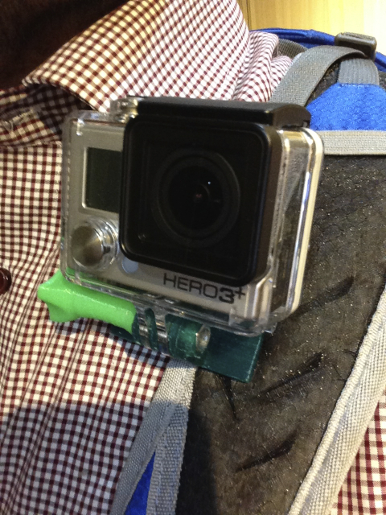
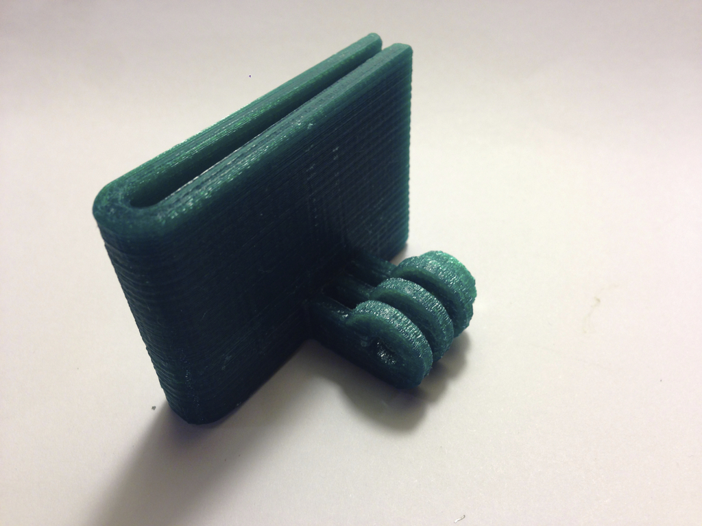
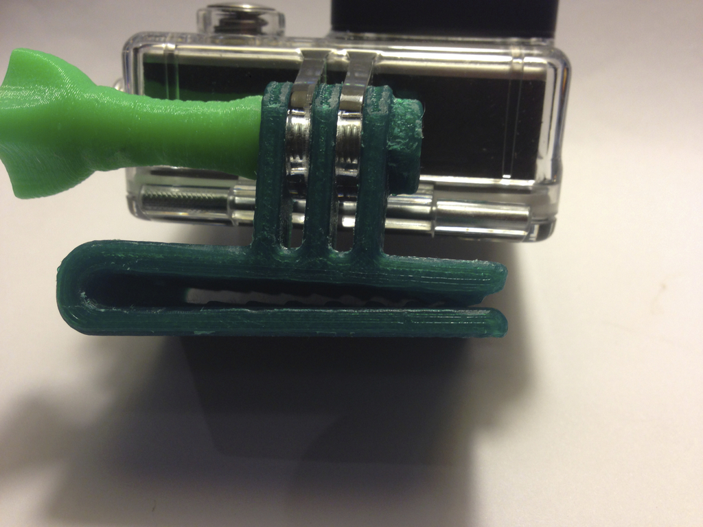
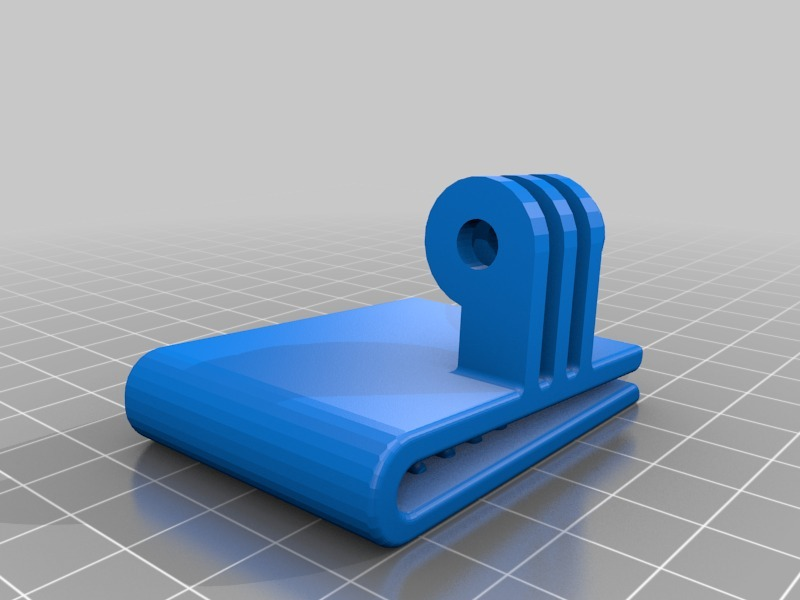
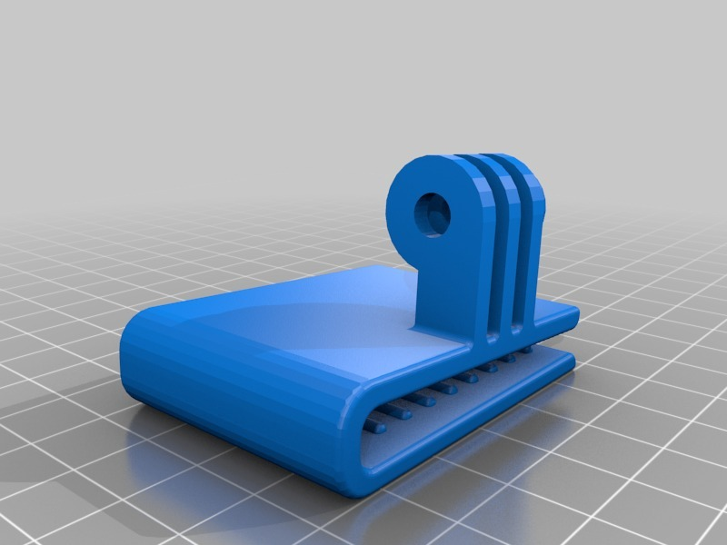

GoPro backpack strap clamp
===============
**Please note: This thing is part of a list that was [automatically generated](https://github.com/carlosgs/export-things) and may have been updated since then. Make sure to check for the current license and authorship.**  

GoPro backpack strap clamp  by HamOp , published Mar 17, 2014

Description
--------
With this clamp, you can attach your GoPro camera to the strap of your backpack, your jacket, belt or any other thin, flat object with a thickness of about 2-3 mm or about 5 mm for the "thicker" version.

Instructions
--------
Can be printed without support if you stand it on the side where the GoPro adapter is. The nut feature needed some simple cleaning for me, but that was no problem.

Files
--------

 [ Backpack_strap_clamp-V5.stl](Backpack_strap_clamp-V5.stl)  

 [ thicker_backpack_strap_clamp.stl](thicker_backpack_strap_clamp.stl)  

Pictures
--------

Tags
--------
accessory , Backpack , GoPro , GoPro_Hero_3_plus , GoPro_Mount , Hero , Hero_3 , Hero_3_plus , hiking , mount  

  

License
--------
GoPro backpack strap clamp by HamOp is licensed under the Attribution - Non-Commercial - Share Alike license.  

By: Stefan
--------
<https://github.com/HamOP>