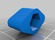

Grinding dust vacuum device
===============
**Please note: This thing is part of a list that was [automatically generated](https://github.com/carlosgs/export-things) and may have been updated since then. Make sure to check for the current license and authorship.**  

Grinding dust vacuum device  by HamOp , published Mar 4, 2014

Description
--------
I normally use my Dremel to clean up my 3D prints and typically get sprinkled over and over with small PLA flakes. This thing screws onto my work bench to hold the hose of my Kaercher vacuum cleaner (diameter approx. 36 mm) so that it can catch at least a little bit of the grinding dust. I also created some custom nozzles to extend the hose a little bit and make it handier to work with.

Instructions
--------
Parts needed:   
 
1 x top.stl   
1 x base.stl   
4 x knob.stl   
4 x hex nut M5   
4 x hex screw M5 x 30 (you will have to try, depending on your vacuum hose)   
 
Push the 4 nuts into the base from the bottom and the 4 screw heads into the knobs. Screw the base to your workbench, put your vacuum hose inside and fix it with the top and the 4 thumbscrews.   
 
If you like, print one or all of the nozzles and enjoy grinding ;-)

Files
--------

 [ base.stl](base.stl)  

 [ top.stl](top.stl)  

 [ Saugtasse-V2.stl](Saugtasse-V2.stl)  

 [ nozzle.stl](nozzle.stl)  

 [ knob.stl](knob.stl)  

Pictures
--------

Tags
--------
dremel , grinding , holder , Vacuum , vacuum_cleaner  

  

License
--------
Grinding dust vacuum device by HamOp is licensed under the Attribution - Non-Commercial - Share Alike license.  

By: Stefan
--------
<https://github.com/HamOP>