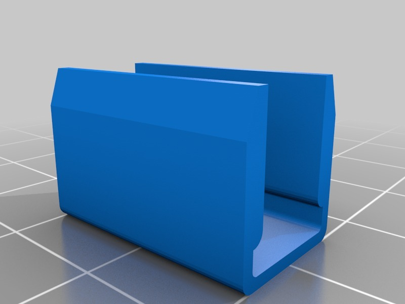
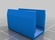
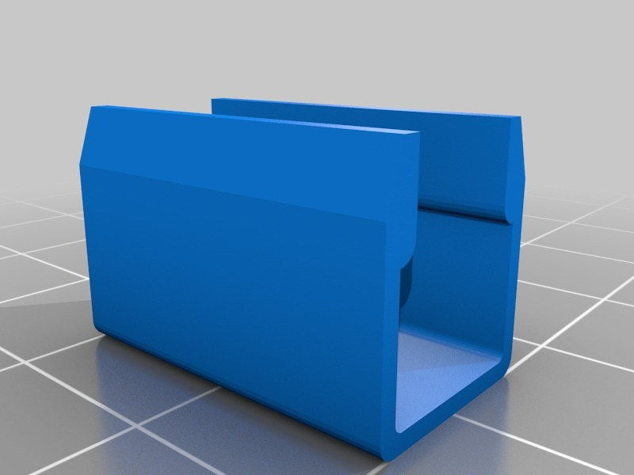

Heat bed clip for K8200 and IKEA mirror
===============
**Please note: This thing is part of a list that was [automatically generated](https://github.com/carlosgs/export-things) and may have been updated since then. Make sure to check for the current license and authorship.**  

Heat bed clip for K8200 and IKEA mirror  by HamOp , published Jan 11, 2014

Description
--------
I made these clips to fix the well known IKEA mirror to the heat bed of my K8200.   
 
Update: Printed them, they don't work as they are. I will have to redesign them, sorry.

Instructions
--------
None

Files
--------

 [ Heatbed_clamp.stl](Heatbed_clamp.stl)  

 [ Heatbed_clamp_V2.stl](Heatbed_clamp_V2.stl)  

Pictures
--------

Tags
--------
accessories , clamp , heat_bed , K8200 , printer_parts  

  

License
--------
Heat bed clip for K8200 and IKEA mirror by HamOp is licensed under the Creative Commons - Attribution - Share Alike license.  

By: Stefan
--------
<https://github.com/HamOP>