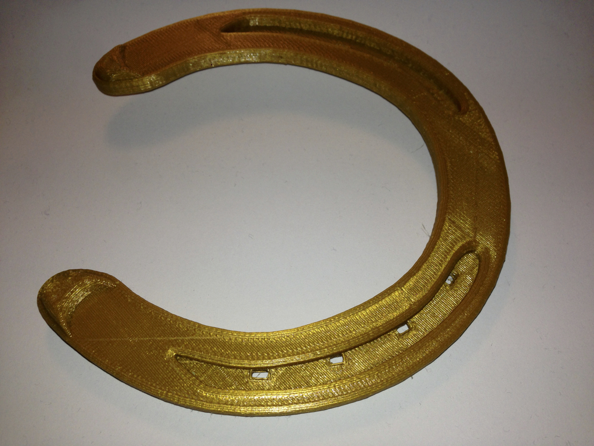
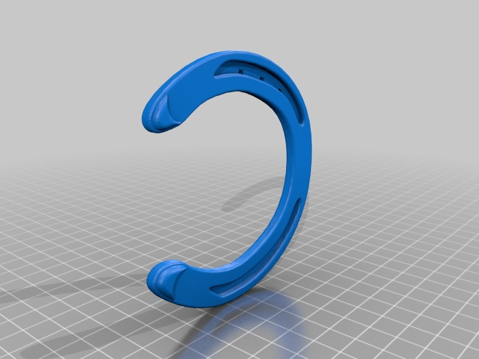

Horse shoe
===============
**Please note: This thing is part of a list that was [automatically generated](https://github.com/carlosgs/export-things) and may have been updated since then. Make sure to check for the current license and authorship.**  

Horse shoe  by HamOp , published Feb 18, 2014

Description
--------
My son needed a horse shoe as a prop for a play at his school - so I quickly made this one.

Instructions
--------
None

Files
--------

 [ Hufeisen-V4.stl](Hufeisen-V4.stl)  

Pictures
--------

Tags
--------
horse , horse_shoe , play , prop  

  

License
--------
Horse shoe by HamOp is licensed under the Creative Commons - Attribution - Non-Commercial license.  

By: Stefan
--------
<https://github.com/HamOP>