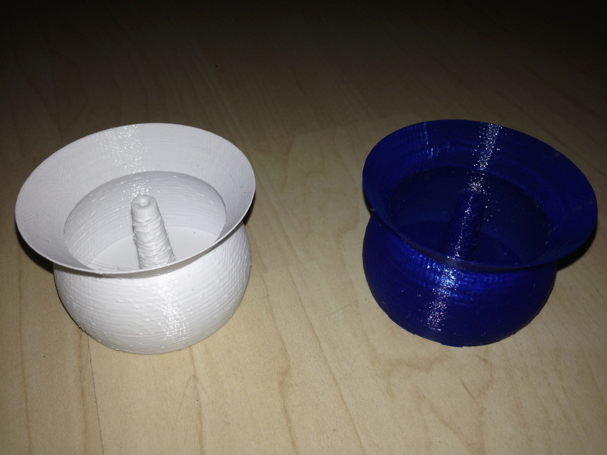
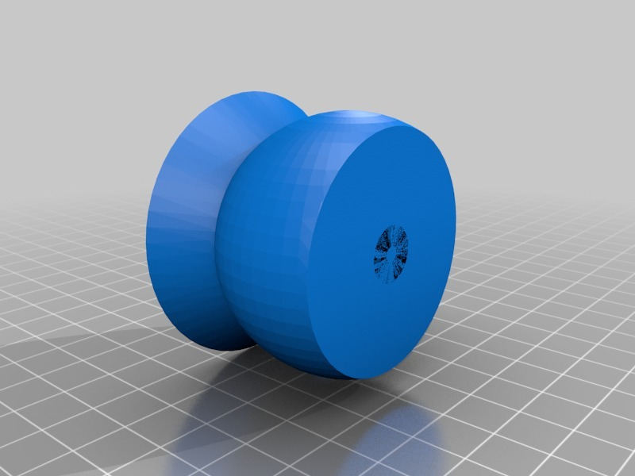

Incense holder - inspired by Catch
===============
**Please note: This thing is part of a list that was [automatically generated](https://github.com/carlosgs/export-things) and may have been updated since then. Make sure to check for the current license and authorship.**  

Incense holder - inspired by Catch  by HamOp , published Jan 12, 2014

Description
--------
My wife really likes the shape of the Catch incense holder, however it is a little bit too small to catch all of the ashes. I adopted the shape and made it a little bit bigger. Additionally, the hole for the incense stick goes all the way through so that you can eventually remove the stick if it's broken or too short to pull it out after burning it.

Instructions
--------
Prints well with one single extrusion as the outer wall. I printed mine with 0.25 mm layer height.

Files
--------

 [ Raucherstabchenhalter.stl](Raucherstabchenhalter.stl)  

 [ Raucherstabchenhalter__repaired_.stl](Raucherstabchenhalter__repaired_.stl)  

Pictures
--------

Tags
--------
holder , incense , incense_holder  

  

License
--------
Incense holder - inspired by Catch by HamOp is licensed under the Creative Commons - Attribution - Non-Commercial license.  

By: Stefan
--------
<https://github.com/HamOP>