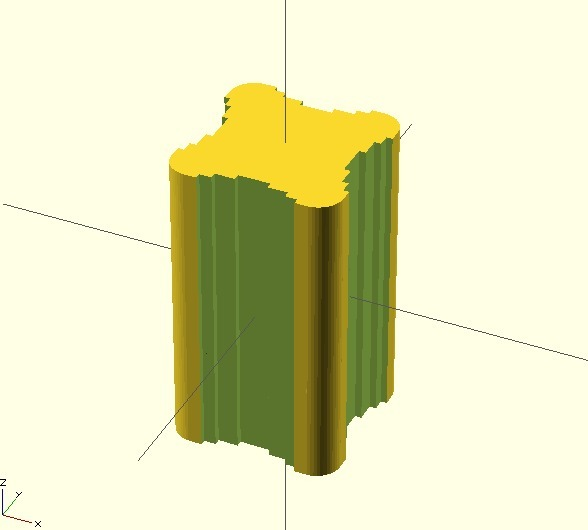

K8200 aluminum frame rod for OpenSCAD
===============
**Please note: This thing is part of a list that was [automatically generated](https://github.com/carlosgs/export-things) and may have been updated since then. Make sure to check for the current license and authorship.**  

K8200 aluminum frame rod for OpenSCAD  by HamOp , published Feb 12, 2014

Description
--------
This is an OpenSCAD module you can use to generate attachments to the K8200 frame - just subtract it from a solid part and you have a fit for the frame.

Instructions
--------
None

Files
--------

 [ K8200_rod.scad](K8200_rod.scad)  

Tags
--------
K8200 , K8200_frame , library , OpenSCAD , OpenSCAD_module  

  

License
--------
K8200 aluminum frame rod for OpenSCAD by HamOp is licensed under the Creative Commons - Attribution - Non-Commercial license.  

By: Stefan
--------
<https://github.com/HamOP>