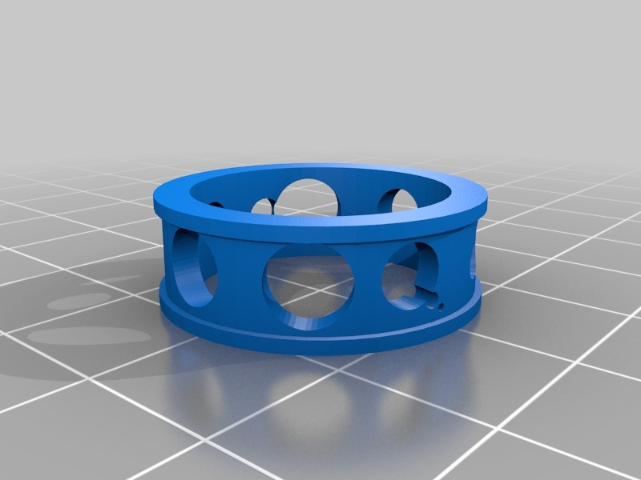
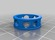

My Customized Random Ring
===============
**Please note: This thing is part of a list that was [automatically generated](https://github.com/carlosgs/export-things) and may have been updated since then. Make sure to check for the current license and authorship.**  

My Customized Random Ring  by HamOp , published Jan 3, 2014

Description
--------
Customized version of <a href="http://www.thingiverse.com/thing:127768" target="_blank" rel="nofollow">thingiverse.com/thing:127768</a> 
 
Created with Customizer! <a href="http://www.thingiverse.com/apps/customizer/run?thing_id=127768" target="_blank" rel="nofollow">thingiverse.com/apps/customizer/run?thing_id=127768</a> 
 

Instructions
--------
Using the following options: 
 
inner_diameter = 19 
seed = 43 
thickness = 2 
height = 8 
mesh_resolution = 50 

Files
--------

 [ randomring_2_20140103-19207-14smso5-0.stl](randomring_2_20140103-19207-14smso5-0.stl)  

Tags
--------
customized  

  

License
--------
My Customized Random Ring by HamOp is licensed under the Creative Commons - Attribution license.  

By: Stefan
--------
<https://github.com/HamOP>