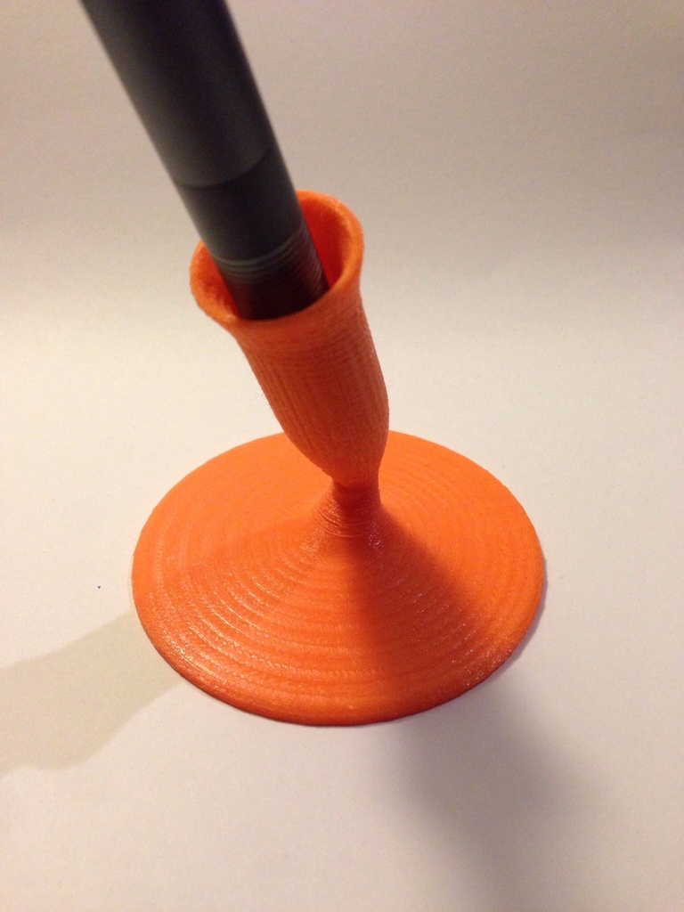
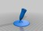

Pen holder
===============
**Please note: This thing is part of a list that was [automatically generated](https://github.com/carlosgs/export-things) and may have been updated since then. Make sure to check for the current license and authorship.**  

Pen holder  by HamOp , published Feb 19, 2014

Description
--------
Simple pen holder, modeled with Fusion 360.

Instructions
--------
None

Files
--------

 [ Stifthalter_2-V4.stl](Stifthalter_2-V4.stl)  

Pictures
--------

Tags
--------
desk , holder , office , pen , pen_holder  

  

License
--------
Pen holder by HamOp is licensed under the Attribution - Non-Commercial - Share Alike license.  

By: Stefan
--------
<https://github.com/HamOP>