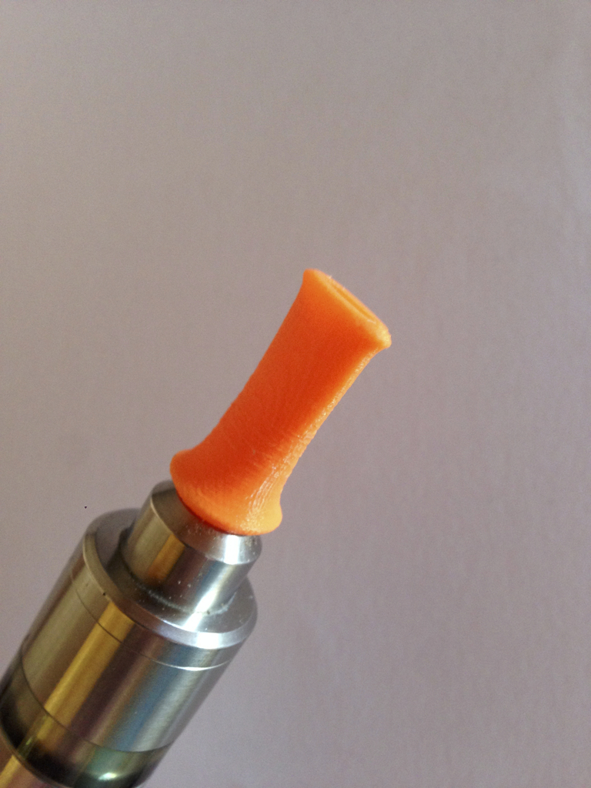
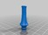
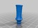
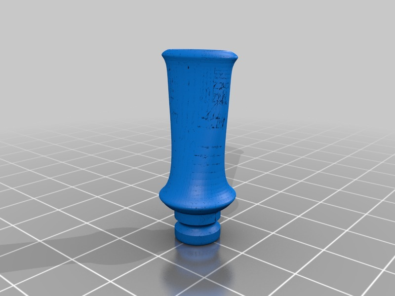
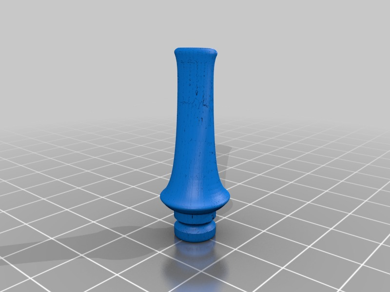

Pipe style drip tip - new design
===============
**Please note: This thing is part of a list that was [automatically generated](https://github.com/carlosgs/export-things) and may have been updated since then. Make sure to check for the current license and authorship.**  

Pipe style drip tip - new design  by HamOp , published Feb 22, 2014

Description
--------
My old design worked quite well but was a little bulky. As I just discovered the sculpt features in Fusion 360, this one was a lot easier to design and looks much more light weight.   
 
Work in progress as I think I will have to tweak it a little bit to be able to print it without internal support.   
 
Update: Added a new version as the first one ("V2") didn't have a hole in the mouth piece anymore after printing due to tolerances. This one works great.

Instructions
--------
If you don't have a fitting O-ring, you can just wrap some dental floss into the groove to create a sealing. Works great for me.

Files
--------

 [ Pipe_drip_tip-V2.stl](Pipe_drip_tip-V2.stl)  

 [ Pipe_drip_tip-V3.stl](Pipe_drip_tip-V3.stl)  

Pictures
--------

Tags
--------
driptip , drip_tip , e-cig , e-smoking , Electronic_Cigarette , pipe  

  

License
--------
Pipe style drip tip - new design by HamOp is licensed under the Attribution - Non-Commercial - Share Alike license.  

By: Stefan
--------
<https://github.com/HamOP>