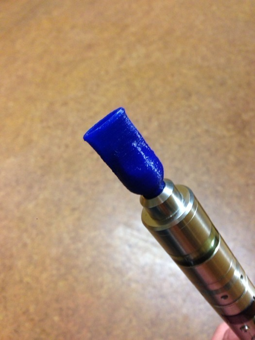
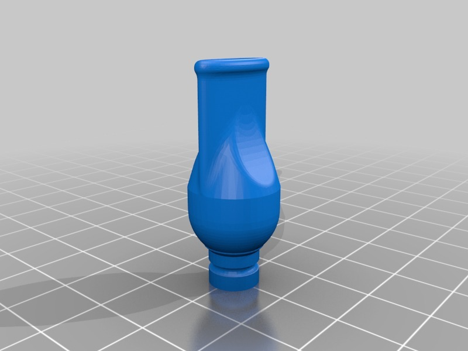

Pipe style drip tip
===============
**Please note: This thing is part of a list that was [automatically generated](https://github.com/carlosgs/export-things) and may have been updated since then. Make sure to check for the current license and authorship.**  

Pipe style drip tip  by HamOp , published Jan 10, 2014

Description
--------
A drip tip for 510 atomizers. I tried to imitate the style and feel of a pipe mouthpiece and made it a little more massive to fit to my big atomizer.

Instructions
--------
None

Files
--------

 [ Pipe_style_Driptip.stl](Pipe_style_Driptip.stl)  

Pictures
--------

Tags
--------
driptip , drip_tip , e-cig , e-smoking , Electronic_Cigarette  

  

License
--------
Pipe style drip tip by HamOp is licensed under the Creative Commons - Attribution - Non-Commercial license.  

By: Stefan
--------
<https://github.com/HamOP>