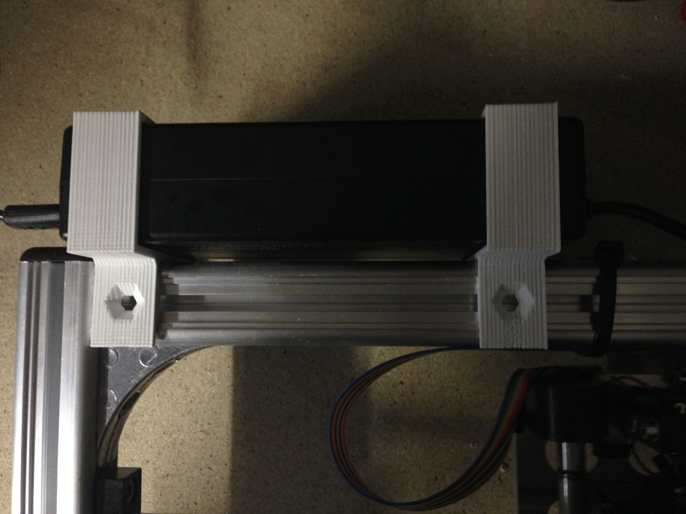
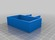
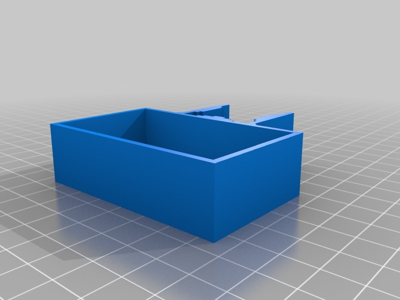

Power Supply Brackets for K8200 printer (new power supply 38 x 65mm)
===============
**Please note: This thing is part of a list that was [automatically generated](https://github.com/carlosgs/export-things) and may have been updated since then. Make sure to check for the current license and authorship.**  

Power Supply Brackets for K8200 printer (new power supply 38 x 65mm)  by HamOp , published Jan 2, 2014

Description
--------
Customized version of <a href="http://www.thingiverse.com/thing:166567" target="_blank" rel="nofollow">thingiverse.com/thing:166567</a>  
 
Created with Customizer! <a href="http://www.thingiverse.com/apps/customizer/run?thing_id=166567" target="_blank" rel="nofollow">thingiverse.com/apps/customizer/run?thing_id=166567</a>  
 

Instructions
--------
Using the following options:   
 
t = 2   
l = 20   
c = 0.3   
dim = [ 38, 65 ]   

Files
--------

 [ nthalter_20140102-21226-d7xe7d-0.stl](nthalter_20140102-21226-d7xe7d-0.stl)  

Pictures
--------

Tags
--------
customized  

  

License
--------
Power Supply Brackets for K8200 printer (new power supply 38 x 65mm) by HamOp is licensed under the Creative Commons - Attribution - Share Alike license.  

By: Stefan
--------
<https://github.com/HamOP>