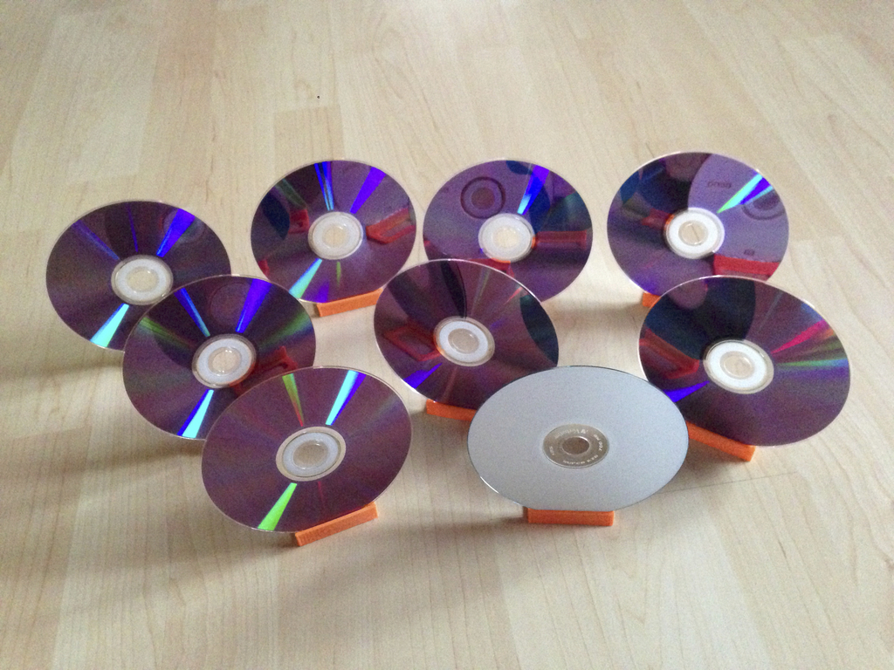
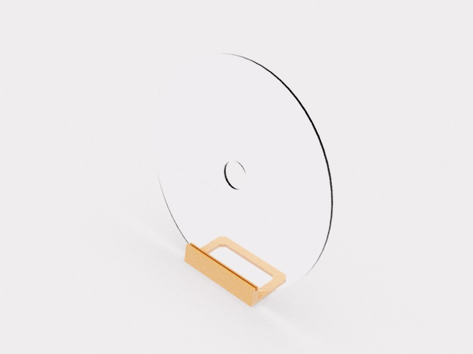
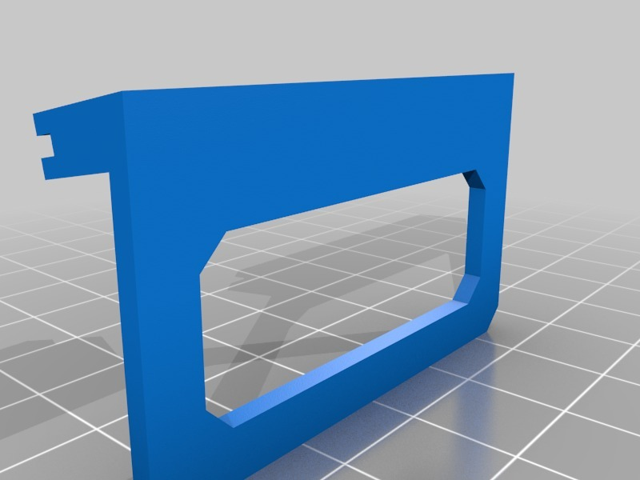

Quick-print target for NERF, Vapor or other toy guns
===============
**Please note: This thing is part of a list that was [automatically generated](https://github.com/carlosgs/export-things) and may have been updated since then. Make sure to check for the current license and authorship.**  

Quick-print target for NERF, Vapor or other toy guns  by HamOp , published Feb 23, 2014

Description
--------
My son wanted some targets for his soft air guns. There are some designs here on thingiverse, but all of them take quite long to print if you want to have them a little bit bigger. This one solves the issue - just print it and put an old CD in the slot. Printing time for one is about 10 minutes on my K8200, and you can make a whole bed full of them in about an hour.

Instructions
--------
Print it an snap / hot-glue an old CD inside.

Files
--------

 [ CD-Zielstander.stl](CD-Zielstander.stl)  

Pictures
--------

Tags
--------
NERF , soft_air , target , toy , Vapor  

  

License
--------
Quick-print target for NERF, Vapor or other toy guns by HamOp is licensed under the Creative Commons - Attribution - Non-Commercial license.  

By: Stefan
--------
<https://github.com/HamOP>