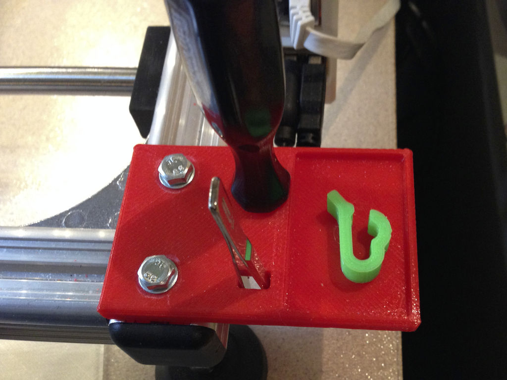
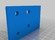
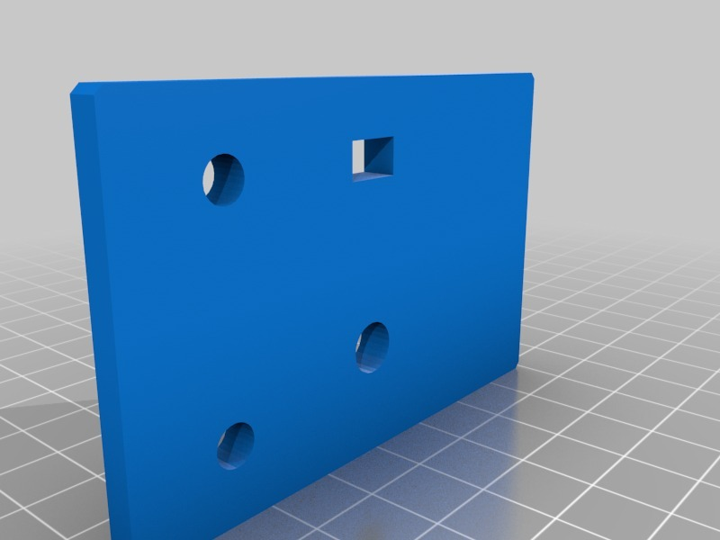

Simple Tool Holder for K8200
===============
**Please note: This thing is part of a list that was [automatically generated](https://github.com/carlosgs/export-things) and may have been updated since then. Make sure to check for the current license and authorship.**  

Simple Tool Holder for K8200  by HamOp , published Jan 18, 2014

Description
--------
I wanted a place to keep my small tweezers and screwdriver at the printer. I also added a small tray for filament clips or such things.

Instructions
--------
To mount, put two washers under the plate on each screw as I left out the profile fittings to be able to print it without support.

Files
--------

 [ Tool_Holder_K8200.stl](Tool_Holder_K8200.stl)  

Pictures
--------

Tags
--------
accessory , holder , K8200  

  

License
--------
Simple Tool Holder for K8200 by HamOp is licensed under the Creative Commons - Attribution - Non-Commercial license.  

By: Stefan
--------
<https://github.com/HamOP>