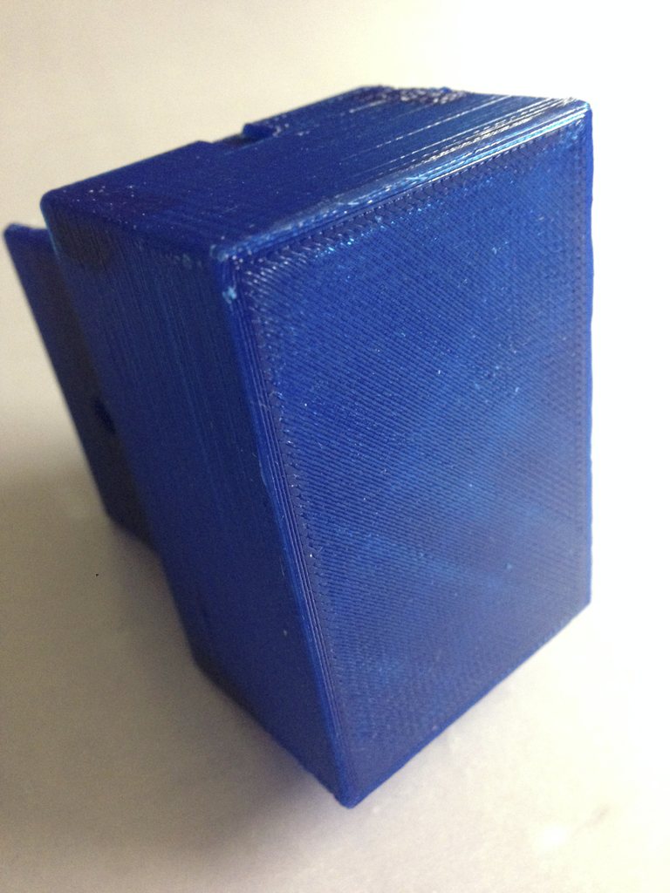

Simple small housing with K8200 brackets
===============
**Please note: This thing is part of a list that was [automatically generated](https://github.com/carlosgs/export-things) and may have been updated since then. Make sure to check for the current license and authorship.**  

Simple small housing with K8200 brackets  by HamOp , published Jan 11, 2014

Description
--------
This is a small housing - inside dimensions 40x60x28mm which I made for my K8200 to keep the PCB for external headed power. It can be attached to the printer frame.   
 
The "Boden V4" is changed to be able to print it upright so that the profile clamp will be stronger as I broke the first one I printed because the layers delaminated when I tried to bend it.

Instructions
--------
None

Files
--------

 [ Boden.stl](Boden.stl)  

 [ Boden_V4.stl](Boden_V4.stl)  

 [ Deckel.stl](Deckel.stl)  

Pictures
--------

Tags
--------
accessory , box , housing , K8200  

  

License
--------
Simple small housing with K8200 brackets by HamOp is licensed under the Creative Commons - Attribution - Non-Commercial license.  

By: Stefan
--------
<https://github.com/HamOP>