Space Navigator handrest (Normal) with space for Oogoo insert
===============
**Please note: This thing is part of a list that was [automatically generated](https://github.com/carlosgs/export-things) and may have been updated since then. Make sure to check for the current license and authorship.**  

Space Navigator handrest (Normal) with space for Oogoo insert  by HamOp , published Feb 12, 2014

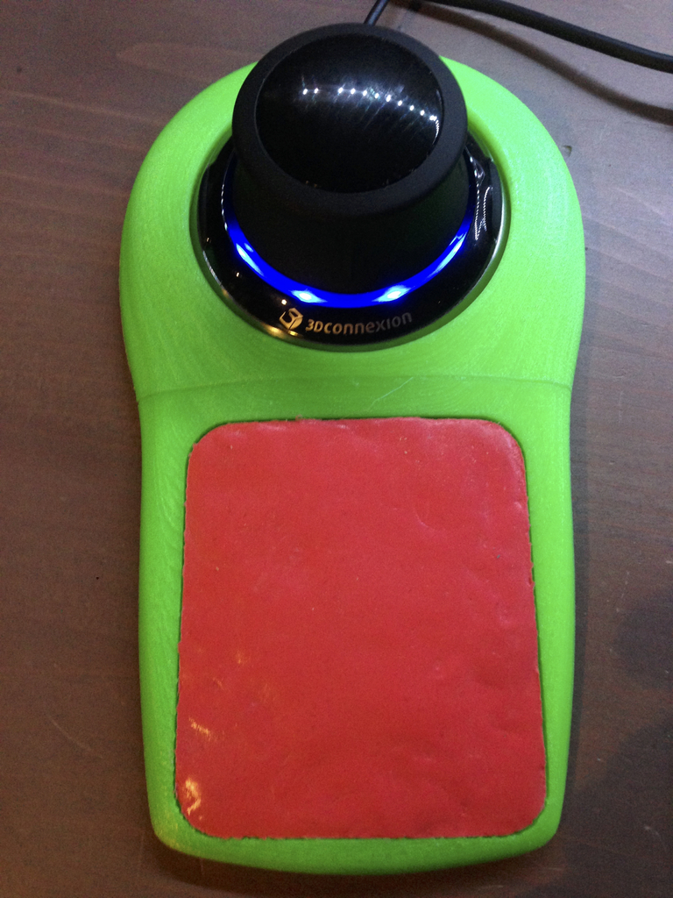

Description
--------
This is basically the original STL from <a href="http://www.thingiverse.com/thing:69226" target="_blank" rel="nofollow">thingiverse.com/thing:69226</a>, just modified it for the insert and the splitting.   
 
I cut out a little bit from the hand rest to be able to mould an Ooogo cushion inside. Should fit for the normal sized Space Navigator.   
 
I also added the thing as two individual parts which should be able to be glued together as I just realized that my print bed is too small ;-)   
 
Update: Just finished it and put some Ooogoo inside. Unfortunately, I didn't manage to make it as smooth as I wanted it to be. Let's see how it will turn out. Anyway, I added a mould for the cushion, maybe that works better.   
 
Update: Finished printing and putting it together which worked quite well. Unfortunately, the part is too small and doesn't fit on the 3D mouse. Now I printed the part scaled up to 1.015 and put some foam rubber feet under it so that it nicely presses down the 3D mouse onto the table. It's really comfortable to work with!

Instructions
--------
Print it, glue it together if you had to print in two halves and put some Oogoo into the pocket on the hand rest. You will have to experiment with the scale - 1.015 worked for me.   
 
Then, put some foam rubber feet under it.

Files
--------
[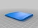](cushion.stl)
 [ cushion.stl](cushion.stl)  

[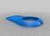](handrest_oogoo.stl)
 [ handrest_oogoo.stl](handrest_oogoo.stl)  

[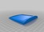](handrest_oogoo_part1.stl)
 [ handrest_oogoo_part1.stl](handrest_oogoo_part1.stl)  

[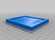](cushion_mould.stl)
 [ cushion_mould.stl](cushion_mould.stl)  

[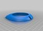](handrest_oogoo_part2.stl)
 [ handrest_oogoo_part2.stl](handrest_oogoo_part2.stl)  

Pictures
--------
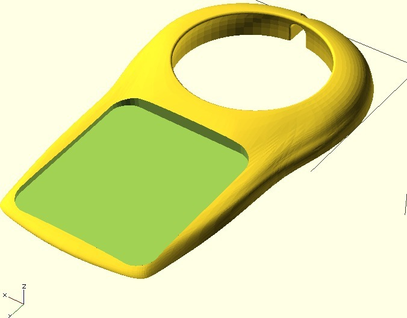
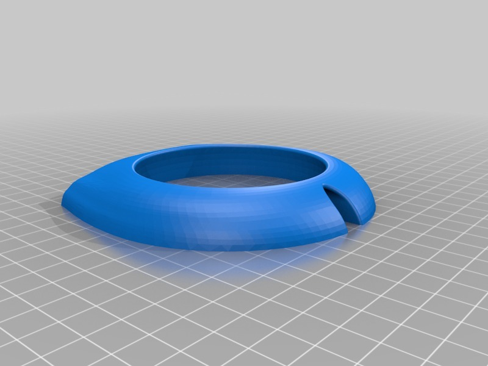
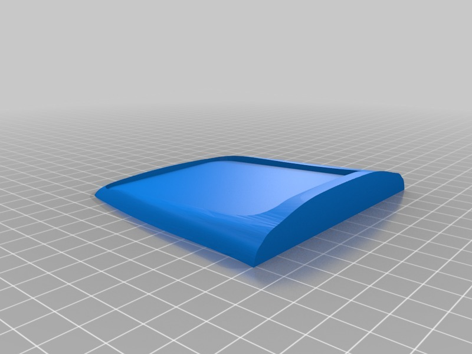
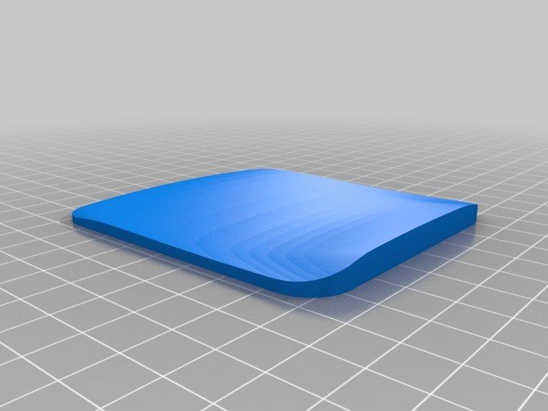

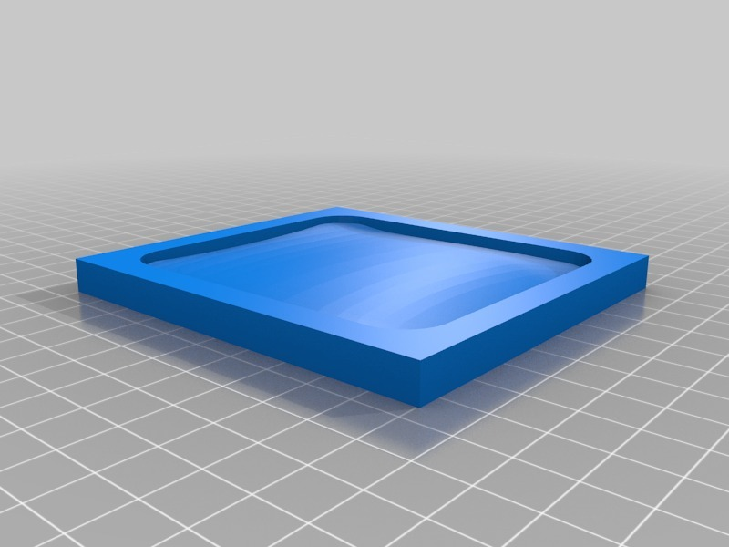

Tags
--------
3D , 3D_connexion , Mouse , Navigator , Oogoo , Spacenavigator  

  

License
--------
Space Navigator handrest (Normal) with space for Oogoo insert by HamOp is licensed under the Creative Commons - Attribution - Non-Commercial license.  

By: Stefan
--------
<https://github.com/HamOP>