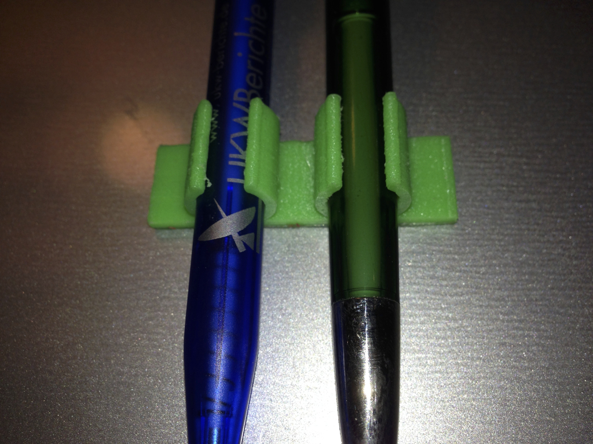
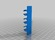
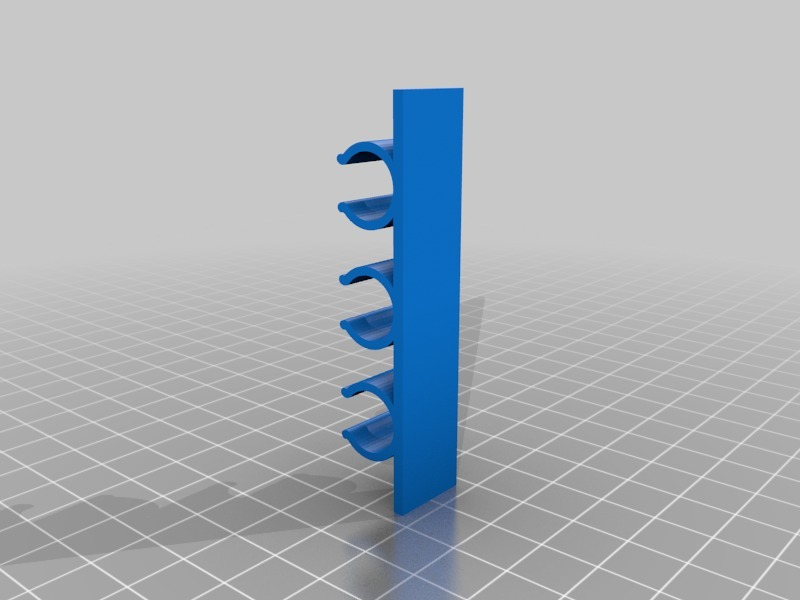

Stick-on pen holder
===============
**Please note: This thing is part of a list that was [automatically generated](https://github.com/carlosgs/export-things) and may have been updated since then. Make sure to check for the current license and authorship.**  

Stick-on pen holder  by HamOp , published Apr 24, 2014

Description
--------
I made this pen holder to stick it onto my aluminum clipboard with double-sided tape.   
 
While cleaning the print up and trying to cut one of the 3 clips off (I broke one one of them by accident), I additionally made one of <a href="http://www.thingiverse.com/thing:72022" target="_blank" rel="nofollow">thingiverse.com/thing:72022</a> ;-)

Instructions
--------
None

Files
--------

 [ pen_holder_3x.stl](pen_holder_3x.stl)  

Pictures
--------

Tags
--------
clipboard , pen , pen_holder  

  

License
--------
Stick-on pen holder by HamOp is licensed under the Attribution - Non-Commercial - Share Alike license.  

By: Stefan
--------
<https://github.com/HamOP>