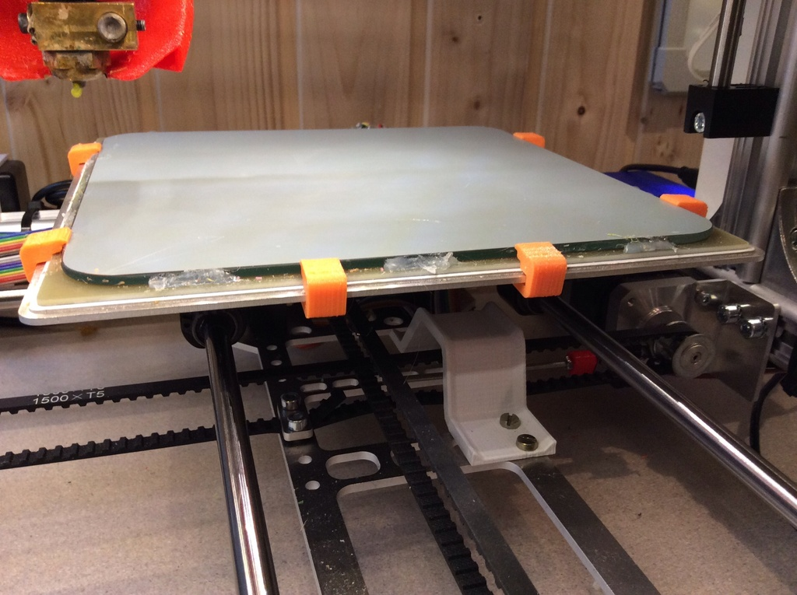
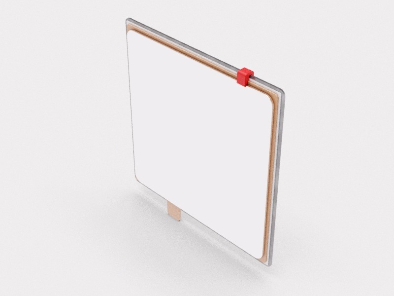
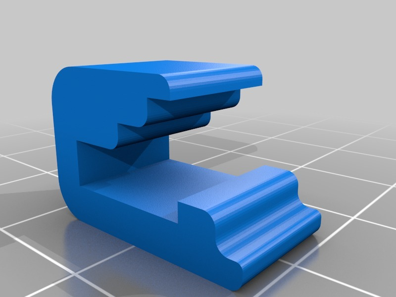

Ultra-low profile IKEA mirror clips for K8200
===============
**Please note: This thing is part of a list that was [automatically generated](https://github.com/carlosgs/export-things) and may have been updated since then. Make sure to check for the current license and authorship.**  

Ultra-low profile IKEA mirror clips for K8200  by HamOp , published Feb 26, 2014

Description
--------
All the other mirror clips I tried didn't work very well because they were either too high so that they took away quite much printing space or were knocked off by the fan nozzle or because they opened up too much one they got warm on the heat bed.   
 
These ones are only 1.5 mm higher than the mirror surface and clip into the holes in the heat bed carrier. Since I have these on my printer, none of them came loose or anything else - and I can use almost all of the mirror surface to print on.

Instructions
--------
Print at 100% infill and clip at least 4 of them, 2 on each side, onto the heat bed / mirror stack. Mirror needs to be well-centered for them to work as they are quite short on top of the mirror (which is intended).   
 
I additionally secured my mirror with some hot-glue around the edges which helps to hold it in place but gets loose without the clips over time.

Files
--------

 [ mirror_clip_shaped.stl](mirror_clip_shaped.stl)  

Pictures
--------

Tags
--------
clip , heat_bed , IKEA_mirror , K8200 , mirror  

  

License
--------
Ultra-low profile IKEA mirror clips for K8200 by HamOp is licensed under the Creative Commons - Attribution - Non-Commercial license.  

By: Stefan
--------
<https://github.com/HamOP>