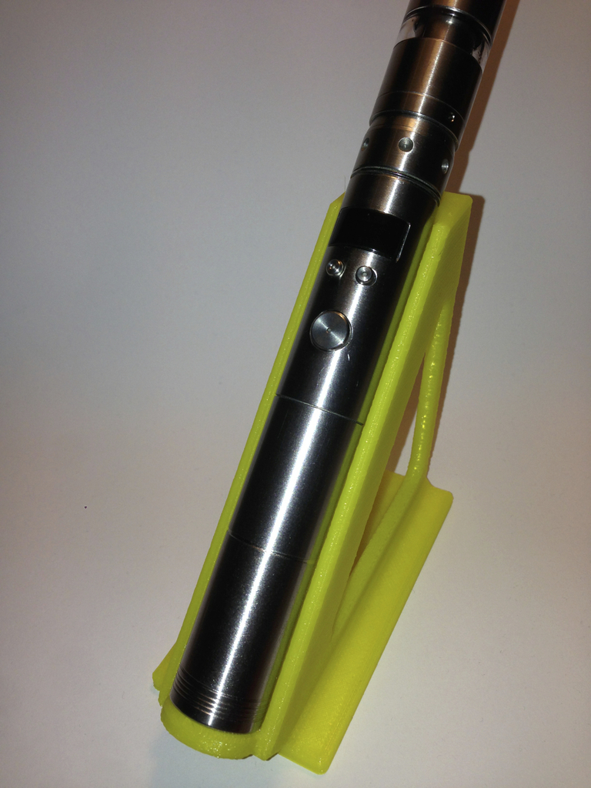
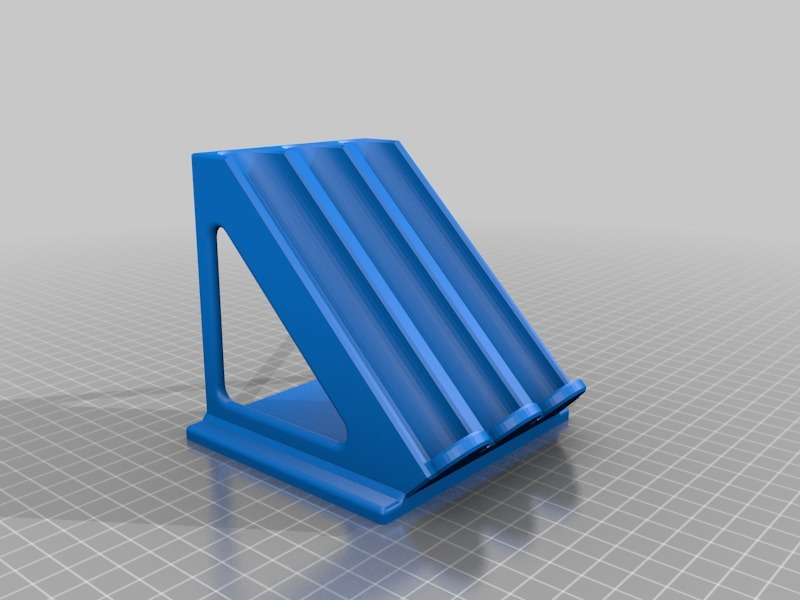
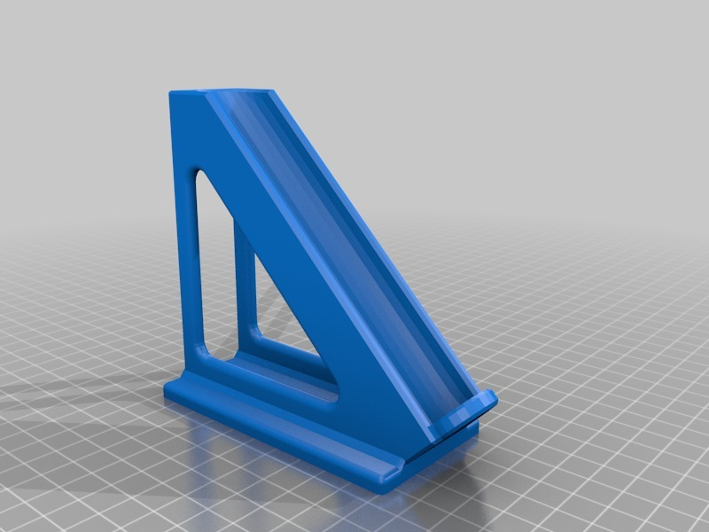
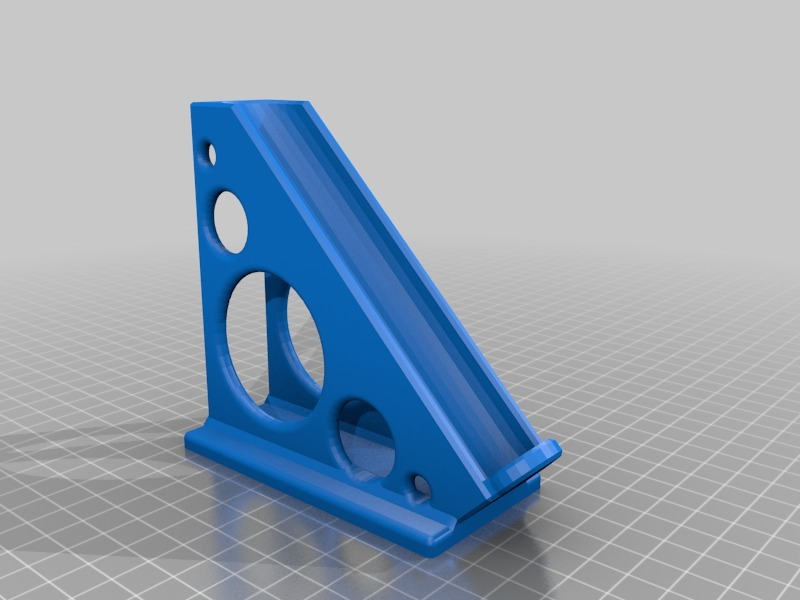

Vape holder for 22 mm mods
===============
**Please note: This thing is part of a list that was [automatically generated](https://github.com/carlosgs/export-things) and may have been updated since then. Make sure to check for the current license and authorship.**  

Vape holder for 22 mm mods  by HamOp , published Jan 30, 2014

Description
--------
This thing is a holder for 22 mm diameter electronic cigarettes. I made this one to fit my VAMO V3, but every mod with 22 mm diameter and about 14 cm length should fit.   
 
I didn't like to put my e-cig flat on the table as sometimes some liquid leaks out of the atomizer. This holder fixes the issue, looks cool and prevents the cig from rolling off the table ;-)   
 
Update 18/05/14: Added a triple holder as requested.

Instructions
--------
Print with some infill (I used 20% in Cura). The "V3" printed nicely without support in PLA on my printer.

Files
--------

 [ Vape_Holder_V2.stl](Vape_Holder_V2.stl)  

 [ triple_vape_holder.stl](triple_vape_holder.stl)  

 [ Vape_Holder_V3.stl](Vape_Holder_V3.stl)  

Pictures
--------

Tags
--------
e-cig , e-smoking , electronic_cigarette , holder , stand , VAMO , vape , vaping  

  

License
--------
Vape holder for 22 mm mods by HamOp is licensed under the Creative Commons - Attribution - Non-Commercial license.  

By: Stefan
--------
<https://github.com/HamOP>