Wrist band for Withings Pulse
===============
**Please note: This thing is part of a list that was [automatically generated](https://github.com/carlosgs/export-things) and may have been updated since then. Make sure to check for the current license and authorship.**  

Wrist band for Withings Pulse  by HamOp , published Jan 31, 2014

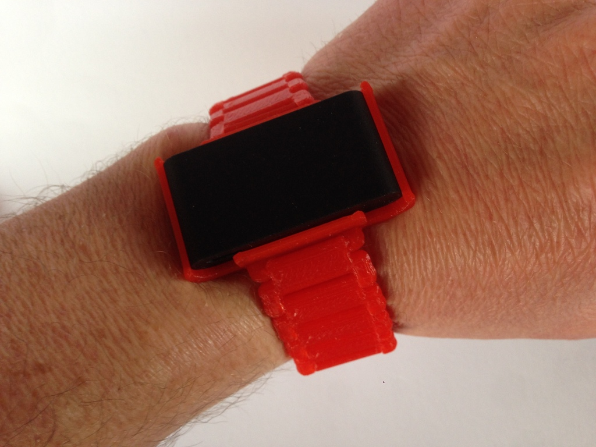

Description
--------
I really like my Withings Pulse. The only annoyance is the velcro wristband for using it as a sleep monitor which stopped staying at my wrist at night after a few months as the velcro stopped sticking sufficiently.   
 
So, let's try this one: I made a clip for emmett's Nano watchband to fix the Pulse to it instead of an iPod Nano. Your can just clip the pulse inside the clip, the button of the pulse is still reachable when it's clipped in. While inside, the heart rate sensor will not work as it cannot see your skin - but it also didn't work well in the velcro band, so I never used it while wearing it with the band.    
 
Let's hope I will not have to search for my Pulse anymore in the morning as I lost it somewhere in my bed at night...   
 
Customizer feature is experimental as it's the first time I try this and the code for the clip looks rather ugly. In Customizer, the clip is static except for the tolerance, so watch out if you change the band too much. The rest is the original code from emmett.   
 
Update: I added a latch STL file for a 20 mm wide and 3 mm thick band (the standard settings in the customizer). It's not perfect, but it works and makes opening and closing of the band much easier.

Instructions
--------
Just print it, no support needed. Depending on your printer and slicer settings, the Pulse should clip in and out nicely. I used Cura at 100% infill and 0.2 mm layer height on my K8200.   
 
If you want, you can just print the clip and use emmet's wrist band with the standard settings and it should also fit as I didn't change it.   
 
You will have to play with the tolerance of the pins to fit to your printer. The assembly STL is at tolerance 0.4 mm which was too tight for my printer. I ended up with 0.5 mm. I also added some test strips with 3 joints each at 0.5, 0.6, 0.7 and 0.8 so you can directly try it out.

Files
--------
[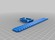](Pulse_wrist_band.stl)
 [ Pulse_wrist_band.stl](Pulse_wrist_band.stl)  

[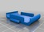](Pulse_clip.stl)
 [ Pulse_clip.stl](Pulse_clip.stl)  

 [ wrist_band_latch.stl](wrist_band_latch.stl)  

 [ test_0.5.stl](test_0.5.stl)  

 [ test_0.7.stl](test_0.7.stl)  

 [ test_0.6.stl](test_0.6.stl)  

 [ test_0.8.stl](test_0.8.stl)  

 [ Pulse_wrist_band_customizable.scad](Pulse_wrist_band_customizable.scad)  

Pictures
--------
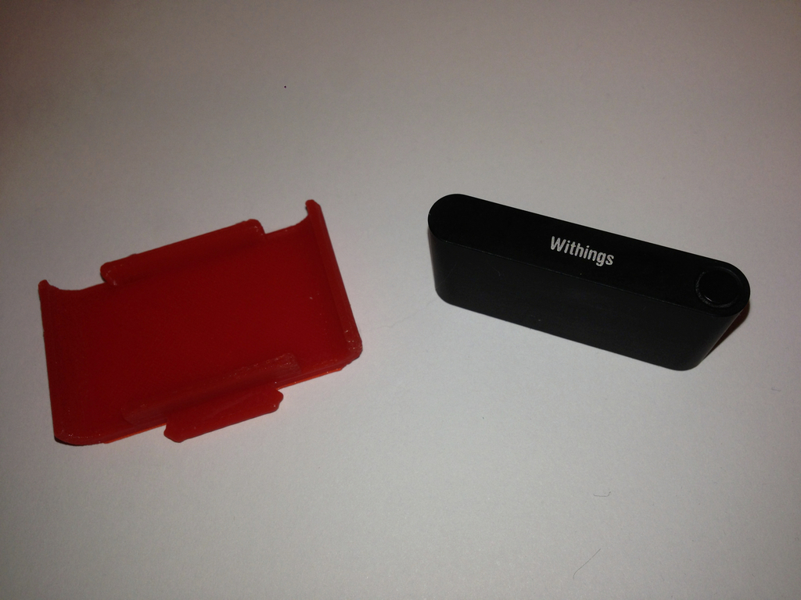
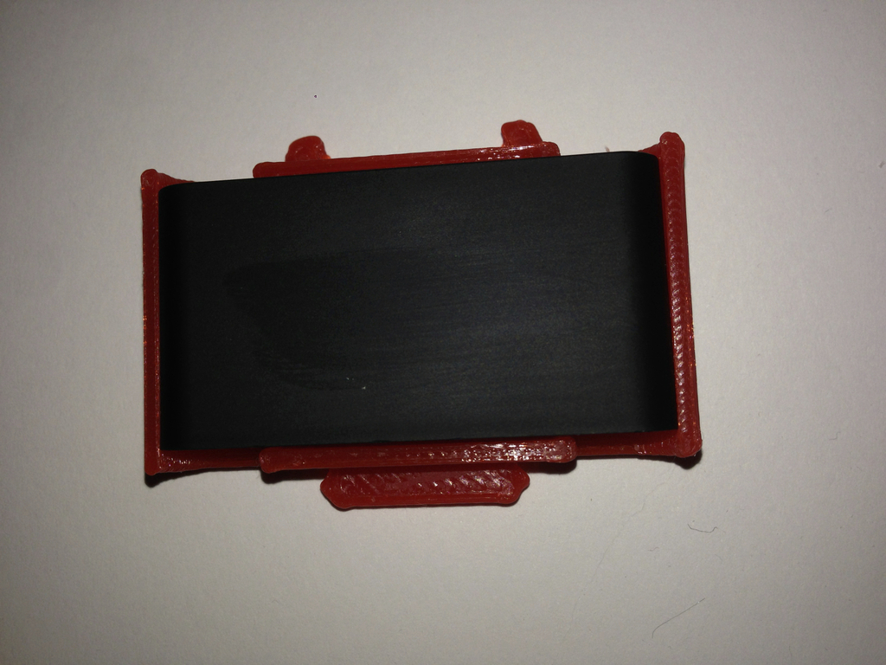
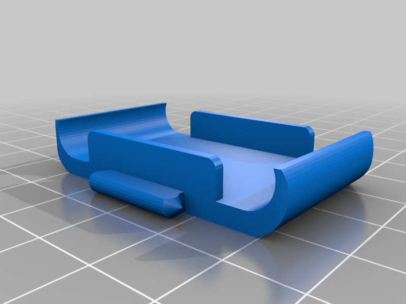
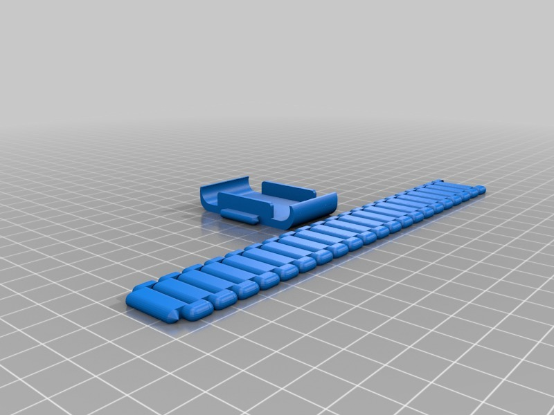
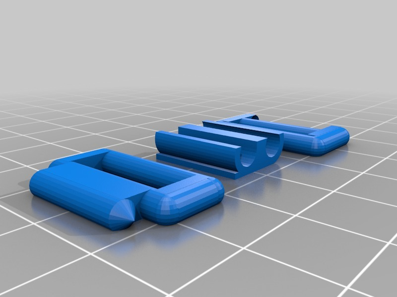
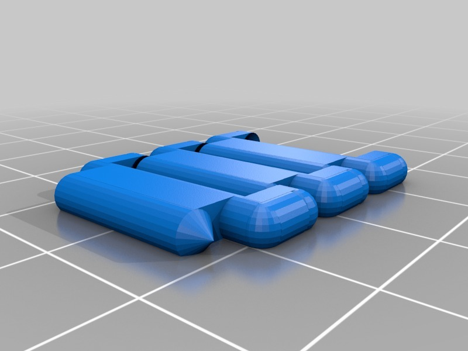
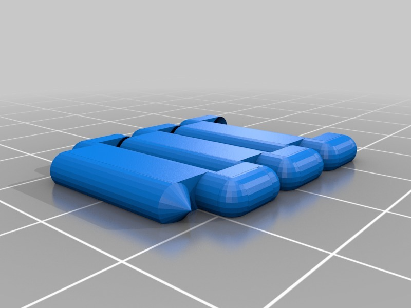
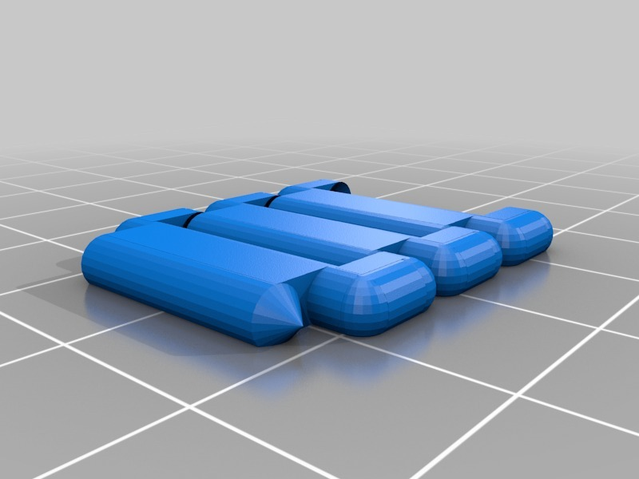

Tags
--------
activity_tracker , customizer , gadget , Pulse , sleep_monitor , watchband , Withings_Pulse , wristband  

  

License
--------
Wrist band for Withings Pulse by HamOp is licensed under the Attribution - Non-Commercial - Share Alike license.  

By: Stefan
--------
<https://github.com/HamOP>