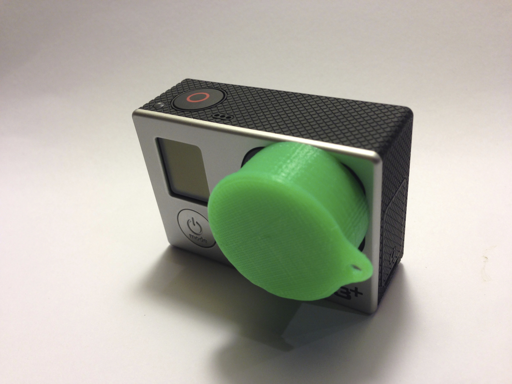
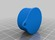
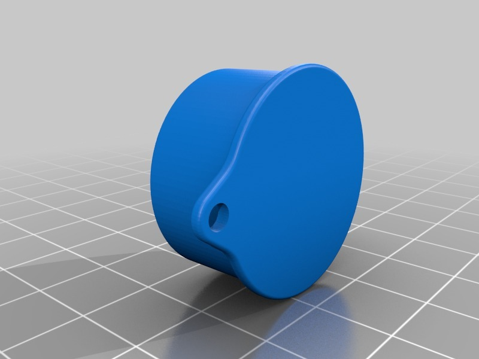

YALC - Yet another lens cap for GoPro Hero 3+
===============
**Please note: This thing is part of a list that was [automatically generated](https://github.com/carlosgs/export-things) and may have been updated since then. Make sure to check for the current license and authorship.**  

YALC - Yet another lens cap for GoPro Hero 3+  by HamOp , published Mar 15, 2014

Description
--------
This one has a small hole so you can fix it to somewhere. Even if you could print a new one anytime, I think just not losing it is better ;-)   
 
It has some tapered ribs on the inner diameter to ensure a good fit on the lens housing.

Instructions
--------
None

Files
--------

 [ lens_cap_round.stl](lens_cap_round.stl)  

Pictures
--------

Tags
--------
accessory , GoPro , GoPro_Hero_3 , GoPro_Hero_3_plus , Hero , lens , lens_cap , protector  

  

License
--------
YALC - Yet another lens cap for GoPro Hero 3+ by HamOp is licensed under the Attribution - Non-Commercial - Share Alike license.  

By: Stefan
--------
<https://github.com/HamOP>