(almost) fully printed GoPro steady cam
===============
**Please note: This thing is part of a list that was [automatically generated](https://github.com/carlosgs/export-things) and may have been updated since then. Make sure to check for the current license and authorship.**  

(almost) fully printed GoPro steady cam  by HamOp , published Mar 29, 2014

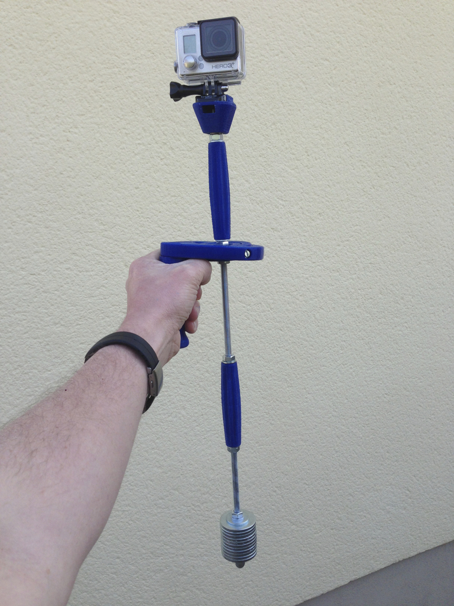

Description
--------
This steady cam only needs a few non-printed parts, the rest can be printed. Z rotation is enabled by a 608 ball bearing, while the other two axes are just running on M4 screws.    
 
The design works great - of course, a "pendulum type" steady cam like this one has some drawbacks, but it's still good enough for some really nice action footage!   
 
After designing this, I found one here which is also very simple and cheap and additionally has a very nice design: <a href="http://www.thingiverse.com/thing:84142" target="_blank" rel="nofollow">thingiverse.com/thing:84142</a>. Maybe I should have searched first ;-)   
I really liked MaximFilm's idea of the handles for the threaded rod, so I decided to adopt it and also add one above and below the gimbal.   
 
Anyway, this one is even cheaper. I paid 1 Euro for a 1m M8 rod and about 3 Euros for almost a kilogram of nuts and washers at our local hardware discounter. The most expensive part is the bearing - if you have to buy it. I took mine from an old pair of rollerblades. So, together with approx. 20 meters of PLA, total cost is much less than 10 Euros.   
 
UPDATE: Parts were re-uploaded in the orientation I printed them.

Instructions
--------
You will need the STLs printed (all of them should print without support besides the GoPro mount) plus:   
 
- one 608 ball bearing   
- 9 M8 nuts   
- some M8 washers   
- an M8 threaded rod, length still tbd - I think it will be around 40 cm   
- an M8x100mm screw for the handle   
- four M4 x 20 mm screws (you will have to trim them)   
- four M4 self-locking nuts   
- four M4 washers   
- some big washers as a weight (I used 10 with a 13 mm bore, so I used the "Weight tube" printed part to center them)

Files
--------
[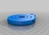](Gimbal_new-V6.stl)
 [ Gimbal_new-V6.stl](Gimbal_new-V6.stl)  

 [ grip-V3.stl](grip-V3.stl)  

[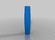](Rod_handle-V2.stl)
 [ Rod_handle-V2.stl](Rod_handle-V2.stl)  

[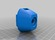](GoPro_mount-V5.stl)
 [ GoPro_mount-V5.stl](GoPro_mount-V5.stl)  

 [ Weight_tube-V2.stl](Weight_tube-V2.stl)  

Pictures
--------
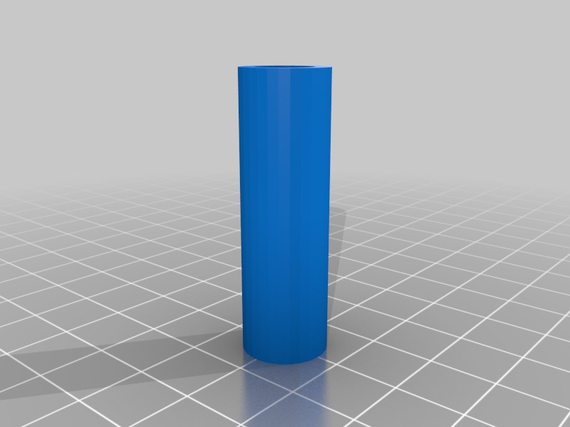
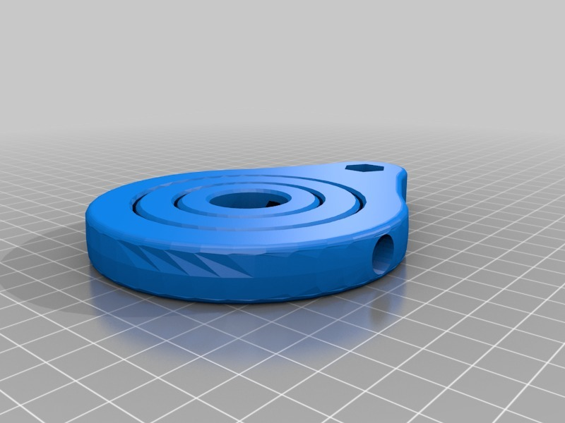
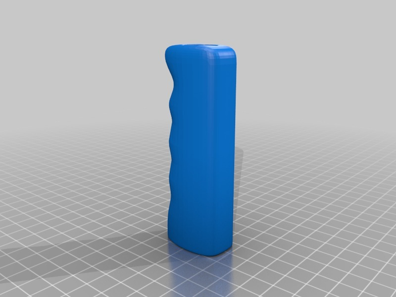
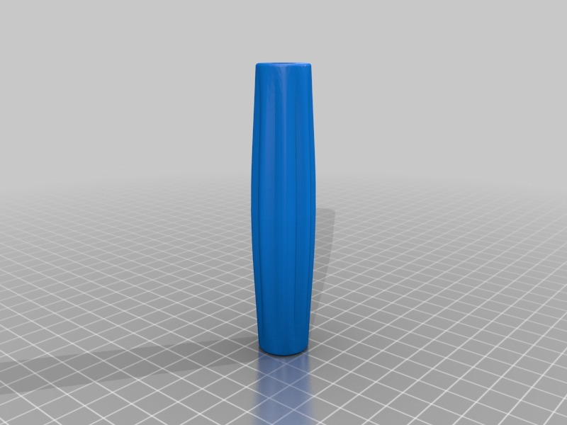
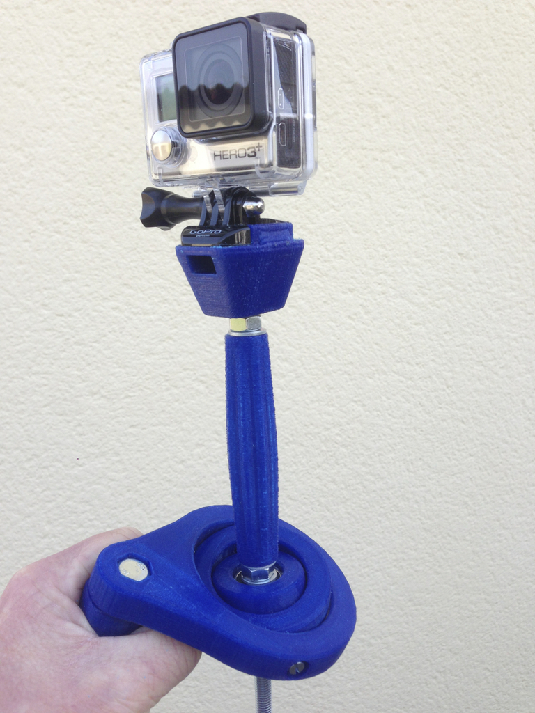
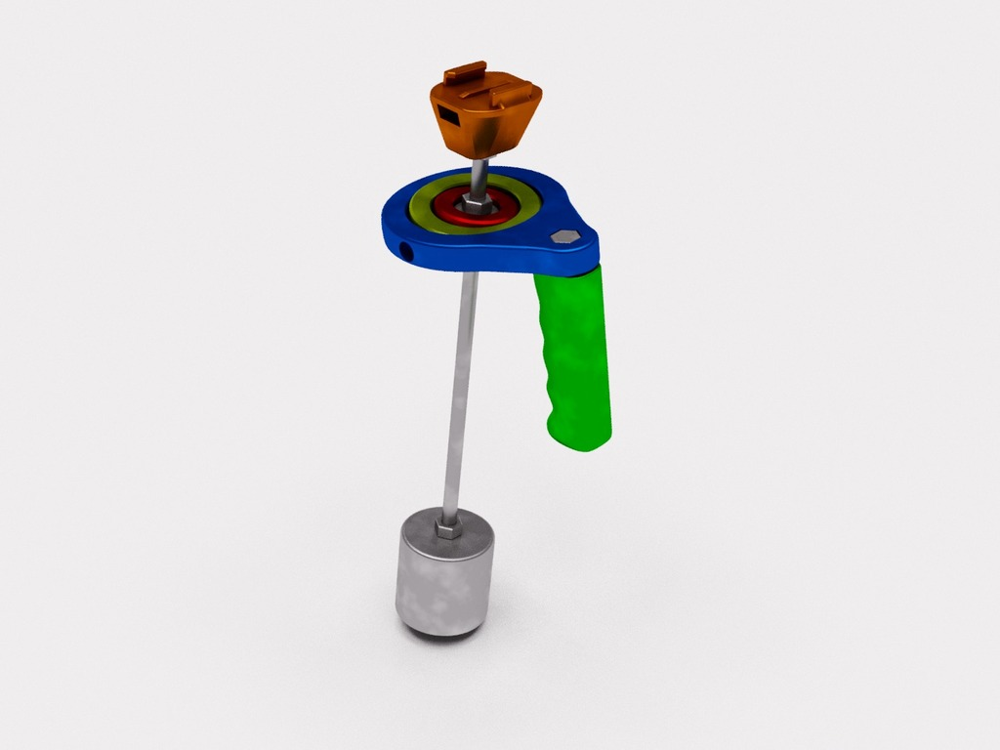
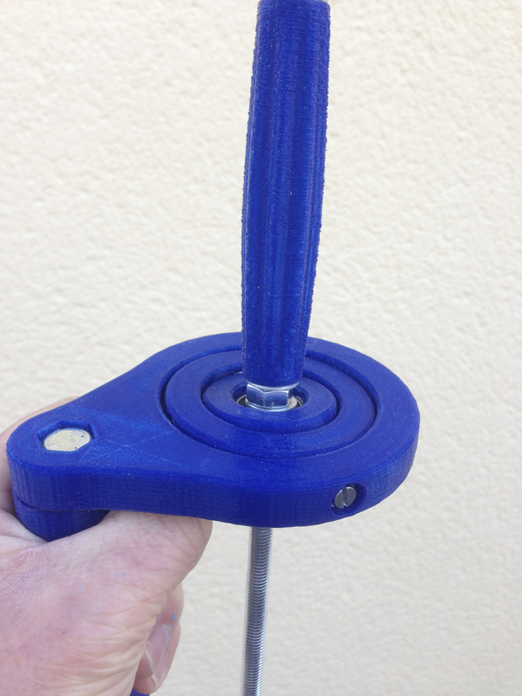
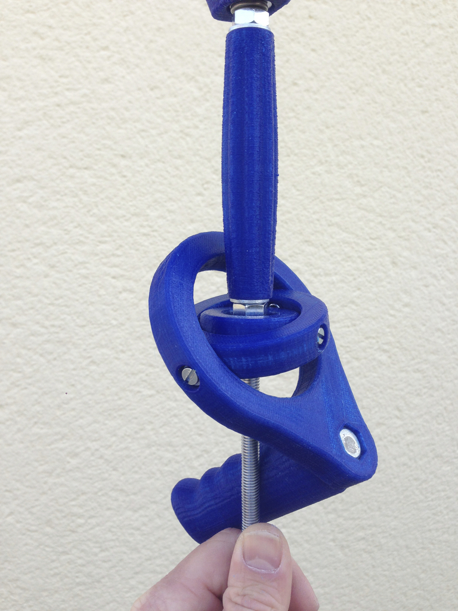
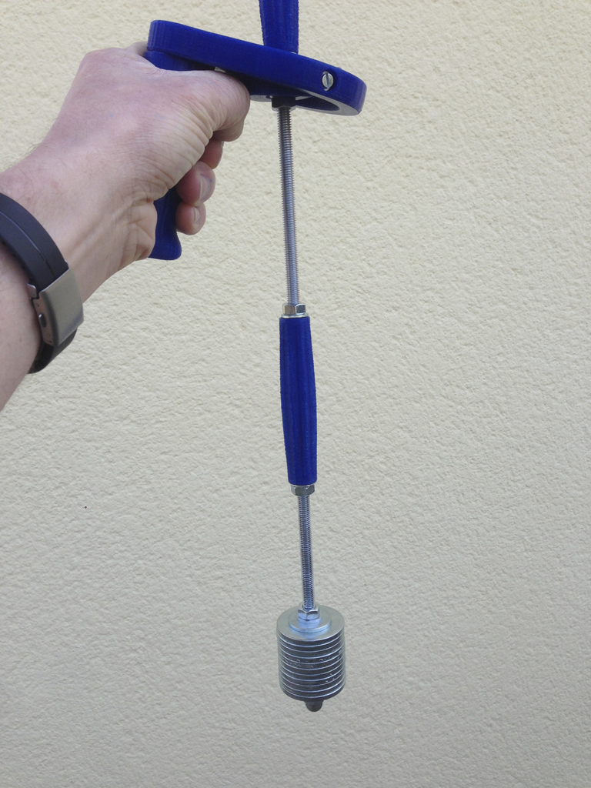
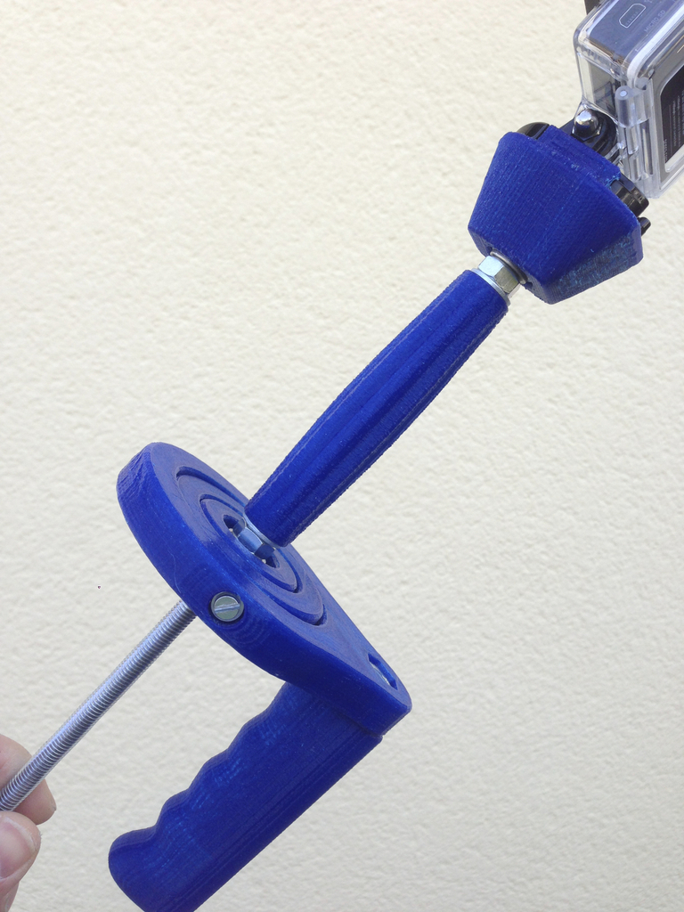
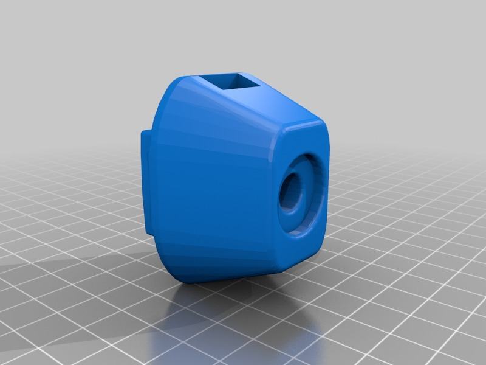

Tags
--------
accessory , gimbal , GoPro , Steady_Cam , video  

  

License
--------
(almost) fully printed GoPro steady cam by HamOp is licensed under the Attribution - Non-Commercial - Share Alike license.  

By: Stefan
--------
<https://github.com/HamOP>