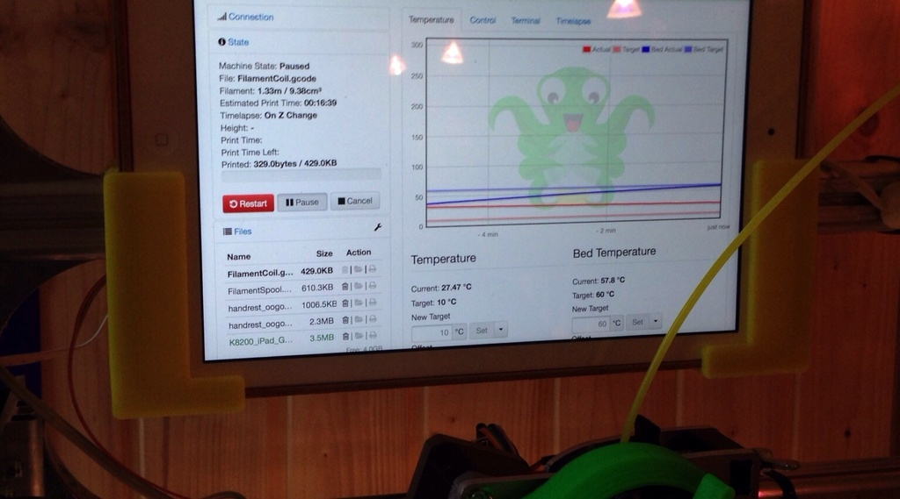
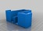
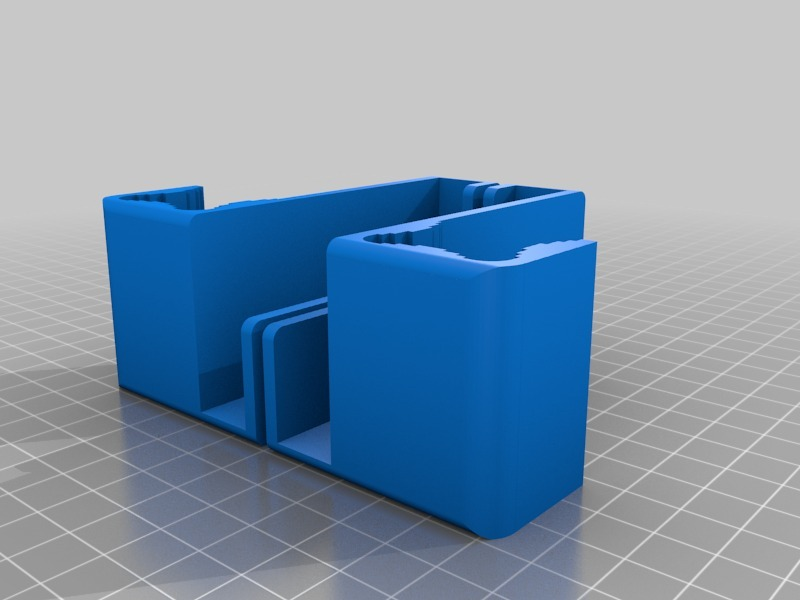

iPad Air holder for K8200 frame
===============
**Please note: This thing is part of a list that was [automatically generated](https://github.com/carlosgs/export-things) and may have been updated since then. Make sure to check for the current license and authorship.**  

iPad Air holder for K8200 frame  by HamOp , published Feb 12, 2014

Description
--------
My K8200 is controlled by a Raspberry Pi running OctoPi, so for setting up a print, I normally use my iPad Air to control it for changing filament and so on. As I don't have a place to securely put it on the closet where the printer is standing, I already almost dropped it.   
 
So, as a solution, I made this dock which clips to the top frame of the K8200 and can hold my iPad Air (with Smart Case) while working on the printer.

Instructions
--------
None

Files
--------

 [ K8200_iPad_Air.stl](K8200_iPad_Air.stl)  

Pictures
--------

Tags
--------
accessory , dock , holder , iPad , iPad_Air , K8200  

  

License
--------
iPad Air holder for K8200 frame by HamOp is licensed under the Creative Commons - Attribution - Non-Commercial license.  

By: Stefan
--------
<https://github.com/HamOP>